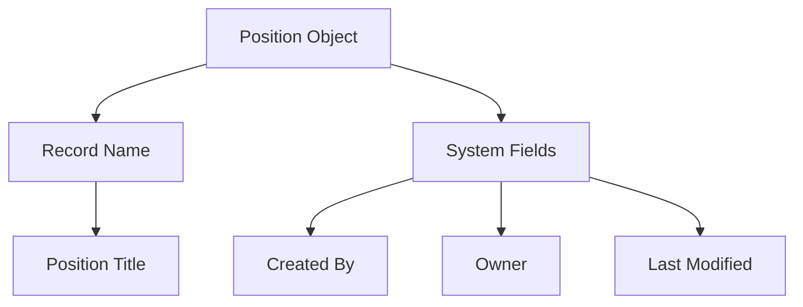

# Lesson 10 — Creating the First Custom Object (Position Object)

## Lesson Summary

This lesson starts the actual Salesforce development work by creating the **first Custom Object — Position** inside the **Recruiting Application**. The lesson explains how objects are created, introduces **Object Manager**, explains **Record Name fields**, and demonstrates how to add the object into a custom application. This object will later store all open positions available in the company.

---

## Key Points

- Objects are Salesforce's equivalent of **tables**
- Fields are Salesforce's equivalent of **columns**
- Custom Objects can be created using:
    - **Object Manager**
    - **Schema Builder**
- Every object requires a **Record Name field**
- Record Name supports:
    - **Text**
    - **Auto Number**
- Position object is added into **Recruiting Application**
- Creating a tab makes object navigation easier

---

## Detailed Notes

### Purpose of Position Object

The Position Object stores job openings available in the company.

**Examples:**
- Salesforce Administrator
- Salesforce Developer
- Business Analyst

**Information that will later be tracked:**
- Position Title
- Status
- Availability
- Additional custom fields

*Note: In this lesson, we only create the object. Custom fields will be added in a future lesson.*

---

## Object Creation Methods

Salesforce provides two ways to create objects.

| Method | Purpose |
| --- | --- |
| **Object Manager** | Create and manage objects |
| **Schema Builder** | Visual object creation and relationships |

*Selected in this lesson:* **Object Manager**

---

## Position Object Structure



---

## Navigation — Create Position Object

This section details the navigation path:
```
Gear Icon → Setup → Object Manager → Create → Custom Object
```

**Purpose:**
- Create custom objects
- Manage fields
- Configure metadata

---

## Steps / Process — Create Position Object

### Step 1 — Open Object Manager

**Navigate:**
`Setup → Object Manager`

**Click:**
`Create → Custom Object`

---

### Step 2 — Enter Object Details

Provide the following settings:

| Field | Value |
| --- | --- |
| **Label** | Position |
| **Plural Label** | Positions |
| **Object Name (API Name)** | Position__c |

**Important:**
The API Name automatically becomes `Position__c`. The `__c` suffix indicates a **Custom Object**.

---

### Step 3 — Configure Record Name

Every object must contain one Record Name.

**Options:**

| Type | Description |
| --- | --- |
| Text | Manual value |
| Auto Number | Automatic increment |

*Selected for Position:* **Record Name = Text**

**Rename Label to:**
```
Position Title
```

**Purpose:**
Acts as the record identifier (e.g., *Salesforce Developer*).

---

### Step 4 — Enable Optional Features

Select the following:
- [x] Allow Reports
- [x] Allow Activities
- [x] Track Field History
- [x] Allow in Chatter Groups

Leave classifications as default.

**Deployment Status:**
`Deployed`

---

### Step 5 — Create Custom Tab

1. Select **Launch New Custom Tab Wizard after saving this custom object**.
2. Click **Save**.

**Purpose:**
Provides direct navigation access to the Position object.

---

### Step 6 — Select Tab Style

1. Choose a Tab Style icon (e.g., **Computer Icon**).
2. Click **Next**.

---

### Step 7 — Configure Profile Visibility

Choose:
`Default On (All Profiles)`

**Meaning:** Users can access the Position tab.

**Tab Visibility Options:**

| Setting | Meaning |
| --- | --- |
| **Default On** | Visible on navigation bar |
| **Default Off** | Accessible via App Launcher but hidden from navigation bar |
| **Tab Hidden** | Not accessible for the profile |

Click **Next**.

---

### Step 8 — Add Tab to Recruiting Application

1. Select **Recruiting** app only.
2. Do **NOT** select standard apps (Sales, Service, etc.).
3. Click **Save**.

**Result:**
```
Recruiting App → Position Tab Created
```

---

## Navigation — Reorder Position Tab

If you want the Position tab to appear before Reports:

**Navigate:**
`Setup → App Manager → Recruiting → Edit → Navigation Items`

**Arrange:**
`Home → Position → Reports → Dashboards`

Click **Save**.

---

## Verify Object Creation

**Navigate:**
`App Launcher → Recruiting → Position`

**Expected Layout:**
```
Position
 └── Position Title
```
*(Only the Record Name field exists currently).*

---

## View Object Information

**Navigate:**
`Gear Icon (on Position record page) → Edit Object`

**View Info:**
- API Name: `Position__c`
- Fields & Relationships
- Page Layouts

---

## Standard Fields Automatically Added

Salesforce automatically creates the following fields upon custom object creation:

| Field | Purpose |
| --- | --- |
| **Created By** | User who created the record |
| **Owner** | Assigned record owner |
| **Last Modified By** | User who latest modified the record |
| **Record Name** | Primary text field identifier |

---

## Important Terms

| Term | Meaning |
| --- | --- |
| **Object** | Salesforce equivalent of a database table |
| **Field** | Salesforce equivalent of a database column |
| **Record Name** | Required primary identifying field for the object |
| **Object Manager** | Main Setup area for managing object schema |
| **Position Object** | Custom object designed to track company job vacancies |
| **API Name** | Developer name used internally by Salesforce (e.g., `Position__c`) |
| **Tab** | Navigation entry allowing users to view records of an object |

---

## Commands / Syntax / Configuration

### Create Custom Object
```
Setup → Object Manager → Create → Custom Object
```

### Open Application
```
App Launcher → Recruiting
```

### Edit Navigation
```
Setup → App Manager → Edit
```

---

## Examples

### Example Object
`Position__c`

**Record Name Label:**
`Position Title`

---

## Certification Focus

### Important for Exam

- **Mapping:**
  - `Object = Table`
  - `Field = Column`
  - `Record = Row`
- Every Object **must** have a Record Name.
- Record Name can only be **Text** or **Auto Number**.

### Common Mistakes
- Forgetting to customize the default Record Name Label.
- Confusing the user-facing Label with the internal API Name.
- Forgetting to create a custom tab (making the object invisible in the UI).
- Adding the custom tab to standard apps instead of custom apps.

### Remember
```
Object → Fields → Tab → Application
```

---

## Real-World Application

The Position Object helps companies:
- Track vacancies across departments.
- Organize recruitment processes.
- Create hiring pipelines and reports.
- Manage recruiting approval workflows.

---

## Quick Revision (30 sec)

- Create objects using the **Object Manager**.
- `Object = Table` in relational databases.
- A **Record Name** is mandatory for every object.
- We chose **Position Title** as the Record Name.
- Custom Object API names end with `__c`.
- Enable Reports and Activities during creation for analytics.
- Create a custom tab so users can access the object in the UI.
- Add the custom tab to the **Recruiting** app and reorder tabs.
- Four system fields (`CreatedById`, `LastModifiedById`, `OwnerId`, `Name`) are created automatically.