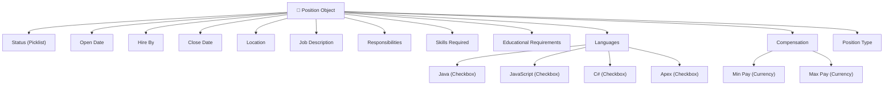

# Lesson 11 — Create Custom Fields for Position Object (Recruiting Application)

## Lesson Summary

In this lesson, we start building the actual **Position Object** by creating its **custom fields**. Fields represent the **columns of a Salesforce object (table)** and define what information can be stored. We create the first field (**Status**) and review the complete field design for the Position object that will be implemented in upcoming lessons. This lesson also introduces **field types**, **picklists**, and **field configuration using Object Manager and Schema Builder**.

---

## Key Points

- Fields = **Columns**
- Objects = **Tables**
- Fields can be created through:
    - **Object Manager**
    - **Schema Builder**
- First field created:
    - **Status**
- Status uses **Picklist** (single-select dropdown list)
- Position object will contain:
    - Dates
    - Picklists
    - Currency
    - Checkboxes
    - Long Text Areas
- Field security and page layout are configured during creation

---

## Navigation — Create Fields for Position Object

**Navigation Path:**
```
Gear Icon → Setup → Object Manager → Position → Fields & Relationships → New
```

**Alternative Navigation:**
```
Setup → Schema Builder → Select Position Object → Add Fields
```

**Purpose:**
- Add custom fields
- Configure field properties
- Manage object relationships

---

## Detailed Notes

### Position Object — Final Field Design

The Position object will eventually store the following business information.

---

### Position Object Architecture



---

### Position Object — Field Specification Table

| Field Name | Data Type | Purpose |
| --- | --- | --- |
| **Status** | Picklist | Position lifecycle |
| **Open Date** | Date | Opening date |
| **Hire By** | Date | Hiring target |
| **Close Date** | Date | Closing date |
| **Location** | Picklist | Job location |
| **Job Description** | Long Text Area | Position details |
| **Responsibilities** | Long Text Area | Responsibilities |
| **Skills Required** | Long Text Area | Required skills |
| **Educational Requirements** | Long Text Area | Qualifications |
| **Java** | Checkbox | Language requirement |
| **JavaScript** | Checkbox | Language requirement |
| **C#** | Checkbox | Language requirement |
| **Apex** | Checkbox | Language requirement |
| **Travel Required** | Checkbox | Travel requirement |
| **Functional Area** | Picklist | Department |
| **Min Pay** | Currency | Minimum salary |
| **Max Pay** | Currency | Maximum salary |
| **Type** | Picklist | Employment type |

---

## Create First Field — Status

### Purpose
Track the current state of hiring.

**Status values:**
- `New Position`
- `Pending Approval`
- `Open - Approved`
- `Closed - Filled`
- `Closed - Not Approved`
- `Closed - Canceled`

---

## Steps / Process — Create Status Field

### Step 1 — Open Position Object

**Navigate:**
`Setup → Object Manager → Position`

**Open:**
`Fields & Relationships`

**Click:**
`New`

---

### Step 2 — Select Data Type

1. Choose **Picklist**.
   *(Reason: Users should only select one status value).*
2. Click **Next**.

---

### Step 3 — Configure Field

Provide the following properties:

| Property | Value |
| --- | --- |
| **Field Label** | Status |
| **Field Name** | Status *(Auto-generated)* |
| **Values** | Enter values, with each value separated by a new line |

**Paste these values:**
```
New Position
Pending Approval
Open - Approved
Closed - Filled
Closed - Not Approved
Closed - Canceled
```

**Select:**
- [x] Restrict picklist to the values defined in the Value Set
- [x] Use first value as default value

Click **Next**.

---

### Step 4 — Configure Security

Choose:
`Visible (All Profiles)`

*(Optional: Set "Read Only" permissions where required).*

Click **Next**.

---

### Step 5 — Add to Page Layout

1. Ensure **Position Layout** is checked (this assigns the field to the object's page layout).
2. Click **Save**.

**Result:**
```
Position
 ├── Position Title
 └── Status
```

---

## Important Field Types

| Type | Usage |
| --- | --- |
| **Auto Number** | Sequence of numbers (e.g., `POS-001`) |
| **Formula** | Calculated field based on expression |
| **Checkbox** | True / False indicator |
| **Currency** | Monetary value (e.g., Salary) |
| **Date** | Calender date (e.g., Open Date) |
| **DateTime** | Date + exact time |
| **Email** | Valid email address |
| **Number** | Standard integer or decimal |
| **Picklist** | Dropdown with single selection |
| **Multi-Select** | Dropdown with multiple selections |
| **Text** | Short text string |
| **Long Text Area** | Paragraph format for long descriptions |
| **Encrypted Text** | Hidden secure values |
| **URL** | Web address hyperlink |

---

## Schema Builder (Alternative Method)

**Navigation:**
`Setup → Schema Builder`

**Actions:**
`Select Position → Elements → Drag Fields → Save`

**Purpose:**
- Visual design of the data schema
- Faster field creation for developers

---

## Important Terms

| Term | Meaning |
| --- | --- |
| **Field** | Equivalent of a column in a database table |
| **Picklist** | Dropdown list allowing a single value selection |
| **Long Text Area** | Text box storing up to 131,072 characters across multiple lines |
| **Checkbox** | Binary flag representing True / False or Yes / No |
| **Currency** | Field data type formatted for currency symbols and decimal places |
| **Page Layout** | Configuration defining which fields display in what order on the user interface |
| **Schema Builder** | Salesforce drag-and-drop tool to visually build the data model |

---

## Commands / Syntax / Configuration

### Create Field
```
Setup → Object Manager → Fields & Relationships → New
```

### Open Schema Builder
```
Setup → Schema Builder
```

---

## Examples

### Example — Position Record Layout

- **Position Title:** Salesforce Developer
- **Status:** Open - Approved
- **Location:** Mumbai, India
- **Min Pay:** 75000
- **Max Pay:** 100000

---

## Certification Focus

### Important for Exam

- Remember:
  `Object → Fields → Page Layout`
- `Picklist = One Value`
- `Checkbox = True / False`
- Know how to:
  - Select the correct field type based on business requirements.
  - Configure field-level security (FLS).
  - Restrict picklist values.

### Common Mistakes
- Using a text field when a Picklist or Checkbox is more appropriate.
- Choosing standard Number instead of Currency for salary fields.
- Forgetting to assign the field to the correct Page Layout.
- Not restricting picklist values when data integrity is required.

---

## Real-World Application

Recruiting systems commonly use:
- **Picklists** → Status, Job Location, Department.
- **Currency** → Salary ranges.
- **Long Text Area** → Job Description, Responsibilities.
- **Date** → Opening and closing dates.
- **Checkbox** → Remote eligibility, Travel requirements.

---

## Quick Revision (30 sec)

- Fields are equivalent to database columns.
- The **Status** picklist field was created to manage the hiring lifecycle.
- Dates are used for timeline tracking.
- Currency is used for pay configuration.
- Long Text Areas are used for descriptions and responsibilities.
- Checkboxes are used for language requirements (Java, Apex, etc.).
- Schema Builder provides a faster, visual way to construct fields.
- Always configure field-level visibility and page layout assignment.