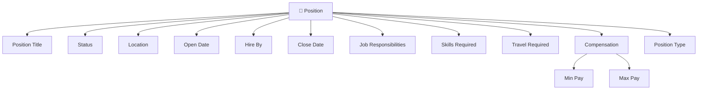
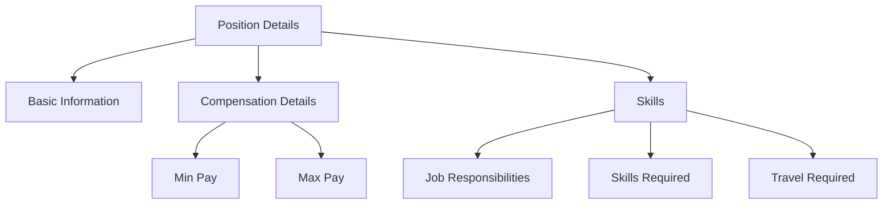

# Lesson 13 — Create Additional Custom Fields & Design Page Layout (Position Object)

## Lesson Summary

In this lesson, we continue enhancing the **Position Object** by adding business-specific fields using **Schema Builder**. We create fields related to **job responsibilities, required skills, travel requirements, compensation, and position type**. The lesson also introduces **Page Layout customization**, **sections**, **field arrangement**, and demonstrates how **Multi-Select Picklist** and **Rich Text Area** behave inside a record form.

---

## Key Points

- Continue building **Position Object** structures.
- Create fields using the visual **Schema Builder**.
- Introduce new field types:
    - **Rich Text Area** (stores formatted text, images, and links)
    - **Multi-Select Picklist** (allows selecting multiple values from dropdown)
    - **Checkbox** (simple Boolean Yes/No check)
    - **Currency** (salaries or costs)
    - **Picklist** (single-value dropdown)
- Create and organize **Page Layout Sections** (one-column vs. two-column layouts).
- Fields created in Schema Builder must be added manually to the page layout.
- Learn field organization patterns to build better user interfaces.

---

## Navigation — Create Additional Fields

**Navigation Path:**
```
Gear Icon → Setup → Schema Builder → Select Position Object → Add Fields
```

**Alternative Navigation:**
```
Setup → Object Manager → Position → Fields & Relationships
```

**Purpose:**
- Add business fields
- Organize the Position user interface

---

## Detailed Notes

### Position Object — Final Enhancement

Fields added in this lesson:

| Field | Type | Purpose |
| --- | --- | --- |
| **Job Responsibilities** | Rich Text Area | Detailed job description |
| **Skills Required** | Multi-Select Picklist | Required technology skills |
| **Travel Required** | Checkbox | Travel requirement indicator |
| **Min Pay** | Currency | Minimum salary range |
| **Max Pay** | Currency | Maximum salary range |
| **Type** | Picklist | Position type (Full-Time, Part-Time, etc.) |

---

### Position Object — Updated Architecture



---

## Steps / Process — Create Additional Fields

### Step 1 — Create Job Responsibilities

**Navigate:**
`Schema Builder → Elements → Rich Text Area → Drag to Position`

**Configure:**

| Property | Value |
| --- | --- |
| **Field Label** | Job Responsibilities |
| **Field Name** | Job_Responsibilities *(Auto-generated)* |
| **Type** | Rich Text Area |

**Optional Settings:**

| Setting | Purpose |
| --- | --- |
| **Visible Lines** | Adjusts default vertical display size of editor box |

Click **Save**.

**Result:**
The field `Job_Responsibilities__c` is created.

**Purpose:**
Allows users to enter formatted, styled text.

**Features Supported:**
- Bold & Italics
- Text coloring & highlighting
- Underline & formatting
- Bullets, lists, and images

---

### Step 2 — Create Skills Required

1. Under **Elements**, select **Multi-Select Picklist** and drag it onto the **Position** box.
2. Configure:

| Property | Value |
| --- | --- |
| **Field Label** | Skills Required |
| **Field Name** | Skills_Required *(Auto-generated)* |

3. **Values entered (separate by new line):**
```
Apex
Salesforce CRM
C#
Java
JavaScript
Microsoft Office
HTML
CSS
```

4. Click **Save**.

**Result:**
The field `Skills_Required__c` is created.

**Purpose:**
Allows users to select multiple required technical skills from the dropdown list.

---

### Step 3 — Create Travel Required

1. Under **Elements**, select **Checkbox** and drag it onto the **Position** box.
2. Configure:

| Property | Value |
| --- | --- |
| **Field Label** | Travel Required |
| **Field Name** | Travel_Required *(Auto-generated)* |
| **Default Value** | Unchecked |

3. Click **Save**.

**Result:**
The field `Travel_Required__c` is created.

**Purpose:**
Represents a simple Boolean Yes / No configuration.

---

### Step 4 — Create Compensation Fields

We will create two separate currency fields.

#### Min Pay
1. Under **Elements**, drag **Currency** onto the **Position** box.
2. Configure:

| Property | Value |
| --- | --- |
| **Field Label** | Min Pay |
| **Length** | 7 |
| **Decimal Places** | 0 |

3. Click **Save**.

#### Max Pay
1. Under **Elements**, drag **Currency** onto the **Position** box.
2. Configure:

| Property | Value |
| --- | --- |
| **Field Label** | Max Pay |
| **Length** | 8 |
| **Decimal Places** | 0 |

3. Click **Save**.

**Result:**
The fields `Min_Pay__c` and `Max_Pay__c` are created.

---

### Step 5 — Create Position Type

1. Drag **Picklist** onto the **Position** box.
2. Configure:

| Property | Value |
| --- | --- |
| **Field Label** | Type |
| **Field Name** | Type *(Auto-generated)* |

3. **Values entered:**
```
Full Time
Part Time
```

4. Click **Save**.

**Result:**
The field `Type__c` is created.

---

## Navigation — Add Fields to Page Layout

> [!IMPORTANT]
> Because these fields were created in Schema Builder, they are **not** automatically placed on the layout. You must add them manually.

**Navigation Path:**
```
Setup → Object Manager → Position → Page Layouts → Position Layout
```

---

## Steps / Process — Organize Page Layout

We will create new sections to make the record page cleaner.

### Create Compensation Section
1. Locate the **Section** element in the palette and drag it onto the page layout.
2. Configure:

| Setting | Value |
| --- | --- |
| **Name** | Compensation Details |
| **Layout** | Two Column |

3. Drag the `Min Pay` and `Max Pay` fields into this section.

---

### Create Skills Section
1. Drag another **Section** element onto the page layout.
2. Configure:

| Setting | Value |
| --- | --- |
| **Name** | Skills |
| **Layout** | Two Column |

3. Drag `Job Responsibilities` and `Skills Required` into this section.
4. Place `Travel Required` in the layout under the appropriate section.
5. Click **Quick Save** (or **Save**).

---

### Page Layout Structure



---

## Create Sample Record

**Navigate:**
`App Launcher → Recruiting → Position → New`

Provide values for testing:

| Field | Value |
| --- | --- |
| **Position Title** | Salesforce Developer |
| **Status** | New Position |
| **Open Date** | *Today* |
| **Location** | Dallas, Texas |

Click **Save**.

**Result:**
The new Position record is successfully created.

---

## Multi-Select Picklist Behavior

On the user interface, the Multi-Select Picklist renders with two boxes:
```
[ Available Values ] ──► [ Move ] ──► [ Selected Values ]
```

**Example Selection:**
- `Apex`
- `Salesforce CRM`
- `Java`

---

## Rich Text Area Behavior

The Rich Text Area field provides an inline editor supporting:
- Bold, Italic, and Underline
- Bullets and numbered lists
- Formatted Text alignment
- Inline image uploads

**Useful for:**
- Job descriptions
- Roles & Responsibilities
- Inline screenshots/notes

---

## Important Terms

| Term | Meaning |
| --- | --- |
| **Rich Text Area** | Field type allowing text formatting, list styling, links, and inline images |
| **Multi-Select Picklist** | Dropdown field allowing users to select multiple options from a value set |
| **Checkbox** | Field data type returning Boolean (True/False) values |
| **Currency** | Numeric field formatted for monetary entries |
| **Page Layout** | Editor that dictates how fields, sections, and related lists display to users |
| **Section** | Header band used to group related fields on page layouts |

---

## Commands / Syntax / Configuration

### Open Schema Builder
```
Setup → Schema Builder
```

### Edit Layout
```
Object Manager → Page Layout
```

### Save Layout
```
Quick Save
```

---

## Examples

### Example Position Record Data

- **Position Title:** Salesforce Developer
- **Skills:** Apex, Java
- **Travel Required:** Yes (checked)
- **Min Pay:** 70000
- **Max Pay:** 100000

---

## Certification Focus

### Important for Exam

- **Rich Text Area = Formatted Content**
- **Multi-Select Picklist = Multiple Values** (represented as semicolon-separated values in database queries).
- **Checkbox = Boolean (True/False)**
- **Rule:** Page Layout configurations do not create database fields. Schema Builder creations require manual page layout positioning.

### Common Mistakes
- Forgetting to position fields on the layout after dragging them in Schema Builder.
- Using a standard single-select Picklist when multiple skill select is required.
- Choosing wrong length or decimal positions for currency parameters.
- Poor section organization, leading to long, unorganized scrolling pages.

### Remember
```
Create Field → Save → Add to Layout → Organize Sections
```

---

## Real-World Application

Recruitment systems commonly use:
- **Rich Text Area** → Storing detailed job descriptions and responsibilities.
- **Multi-Select Picklist** → Selecting required skills and technologies.
- **Checkbox** → Remote work, travel requirements, signing bonuses.
- **Currency** → Managing salary parameters (min/max range).
- **Sections** → Splitting administrative info from compensation and specifications.

---

## Quick Revision (30 sec)

- Added **Job Responsibilities** (Rich Text Area).
- Added **Skills Required** (Multi-Select Picklist).
- Added **Travel Required** (Checkbox).
- Added **Min Pay** and **Max Pay** (Currency).
- Added **Position Type** (Picklist).
- Used **Schema Builder** for fast drag-and-drop creation.
- Updated the page layout to display these fields.
- Organized the form into clean **Sections** (Compensation Details, Skills).
- Tested and verified by creating a sample record.