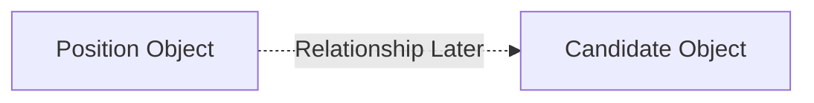
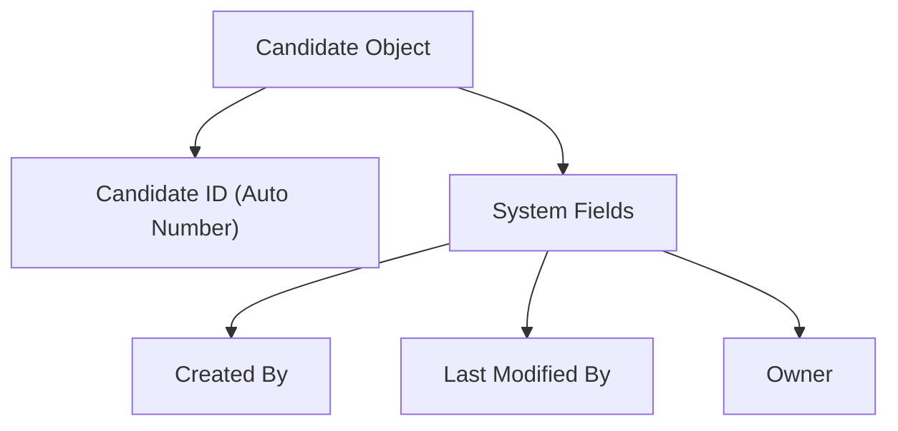

# Lesson 14 — Create Candidate Custom Object (Recruiting Application)

## Lesson Summary

In this lesson, we create the second major custom object for the Recruiting Application: the **Candidate Object**.

Previously, we created the **Position Object** to track available job openings. Now we create the **Candidate Object** to store information about applicants applying to those positions.

This lesson introduces:
- Creating a new **Custom Object**.
- Using **Auto Number** as the Record Name.
- Adding the object into the **Recruiting Application**.
- Reordering application navigation.
- Understanding future relationships between Position and Candidate.

This object will later be expanded with candidate-specific fields.

---

## Key Points

- Create the **Candidate Object**.
- Store applicant information.
- Use **Auto Number** (e.g. `C-00001`) instead of Text for the Record Name.
- Add the Candidate tab into the Recruiting App.
- Configure profile visibility settings.
- Understand object relationships.
- Learn object creation using Schema Builder (overview).

---

## Navigation — Create Candidate Object

**Navigation Path:**
```
Gear Icon → Setup → Object Manager → Create → Custom Object
```

**Purpose:**
- Create new business objects
- Configure metadata
- Build recruiting application

---

## Detailed Notes

### Why Create Candidate Object?

- **Position Object** stores available job openings.
- **Candidate Object** stores information about the people applying for those openings.

**Examples of information that will be stored:**
- First Name
- Last Name
- Phone Number
- Email
- Address
- Experience
- Education
- Employment Status
- Citizenship
- Visa Requirement

This information will later be related to job positions using object relationships.

---

### Recruiting Application Architecture (Current)



**Current Status:**
- [x] Position created
- [x] Candidate created
- [ ] Relationship later (to be established)

---

## Steps / Process — Create Candidate Object

### Step 1 — Open Object Manager

**Navigate:**
`Setup → Object Manager`

**Click:**
`Create → Custom Object`

---

### Step 2 — Configure Object Information

Enter the following settings:

| Setting | Value |
| --- | --- |
| **Label** | Candidate |
| **Plural Label** | Candidates |
| **Starts with Vowel** | No |
| **Object Name** | Candidate |

**API Name becomes:**
```
Candidate__c
```

---

### Step 3 — Configure Record Name

Unlike the Position Object, we will configure an automatic numbering format for Candidates.

**Type:**
Choose **Auto Number**.

**Configuration details:**

| Property | Value |
| --- | --- |
| **Display Format** | C-{0000} |
| **Starting Number** | 1 |

**Example Output:**
- `C-001`
- `C-002`
- `C-003`

**Purpose:**
Ensures Candidate IDs generate automatically upon creation.

---

### Step 4 — Enable Optional Features

Select the following:
- [x] Allow Reports
- [x] Allow Activities
- [x] Track Field History

Leave **Object Classification** settings as default.

**Deployment Status:**
`Deployed`

---

### Step 5 — Create Candidate Tab

1. Check **Launch New Custom Tab Wizard after saving this custom object**.
2. Click **Save**.
3. Choose a Tab Style icon (e.g., **People Icon**).
4. Click **Next**.

---

### Step 6 — Configure Profile Visibility

Choose:
`Default On (All Profiles)`

**Meaning:**
All users can access the Candidate tab on their navigation bar.

Click **Next**.

---

### Step 7 — Add to Recruiting Application

1. Select **Recruiting** application only.
2. Do **NOT** select standard applications (Sales, Service, etc.).
3. Click **Save**.

**Resulting Structure:**
```
Recruiting
 ├── Home
 ├── Position
 └── Candidate
```

---

## Verify Candidate Creation

**Navigate:**
`App Launcher → Recruiting → Candidates`

**Click:**
`New`

**Click:**
`Save`

**Result:**
The record is saved with `Candidate ID = C-001`.

Create another record and click **Save**.

**Result:**
The record is saved with `Candidate ID = C-002` (Auto Number increments automatically).

---

## Navigation — Change Candidate Tab Order

**Goal:**
Move the Candidate tab to display directly after the Position tab.

**Navigate:**
`Setup → App Manager → Recruiting → Edit → Navigation Items`

**Arrange list order:**
`Home → Position → Candidate → Reports → Dashboards`

Click **Save**.

---

## Candidate Object Structure



---

## Current Fields in Candidate Object

| Field | Type |
| --- | --- |
| **Candidate ID** | Auto Number |
| **Created By** | Standard (Audit) |
| **Owner** | Standard (Audit) |
| **Last Modified By** | Standard (Audit) |

*(No business-specific fields have been added yet; they will be created in the next lesson).*

---

## Alternative Method — Schema Builder

Objects can also be created visually on the schema canvas.

**Navigation:**
`Setup → Schema Builder`

**Actions:**
`Elements → Object → Drag to Canvas → Configure`

*Note: The same configuration and parameters apply.*

---

## Important Terms

| Term | Meaning |
| --- | --- |
| **Candidate Object** | Custom object designed to store job applicant details |
| **Auto Number** | System-generated numbering format that increments automatically |
| **Record Name** | Required identification field for a Salesforce object |
| **API Name** | Internal technical name used by developers (ends with `__c` for custom elements) |
| **Object Manager** | Configuration area for creating and editing object metadata |
| **Custom Tab** | User interface element allowing navigation to an object |

---

## Commands / Syntax / Configuration

### Create Object
```
Setup → Object Manager → Create → Custom Object
```

### Edit Navigation
```
Setup → App Manager → Navigation Items
```

### Open Recruiting Application
```
App Launcher → Recruiting
```

---

## Examples

### Example Candidate Records Generated
- `Candidate ID: C-00001`
- `Candidate ID: C-00002`

---

## Certification Focus

### Important for Exam

- **Record Name Selection:** Understand when to use **Text** (user enters value manually) vs. **Auto Number** (system automatically assigns a formatted sequence).
- **Auto Number syntax:** Know how the placeholder `{0000}` behaves (e.g. `C-{0000}` translates to `C-001`, `C-002`, etc.).
- **Naming Conventions:** Internal API names always suffix with `__c` (e.g., `Candidate__c`).

### Common Mistakes
- Forgetting to launch the Custom Tab wizard (meaning users cannot navigate to the object in the UI).
- Configuring the wrong Auto Number format (e.g., missing curly braces around the padding digits).
- Adding the custom object to the wrong application layout.

### Remember
```
Create Object → Configure Record Name → Create Tab → Add to App → Verify
```

---

## Real-World Application

The Candidate Object helps companies:
- Store applicant contact details, qualifications, and employment histories.
- Track candidates through various stages of the recruiting lifecycle.
- Build automations (email alerts, review tasks).
- Model relational data models (linking candidates to position applications).

---

## Quick Revision (30 sec)

- Created the Candidate custom object.
- Used **Auto Number** (format: `C-{0000}`) for the Record Name.
- Candidate records generate IDs automatically (e.g., `C-001`).
- Created a custom tab with a **People Icon**.
- Added the tab exclusively to the **Recruiting** application.
- Reordered navigation tabs to display Candidates directly after Positions.
- Viewed default system audit fields.
- Discussed visual object creation using the **Schema Builder**.