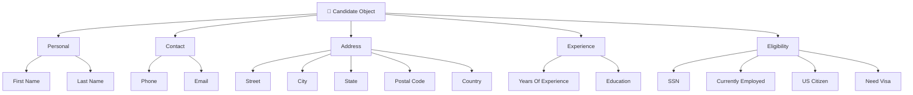
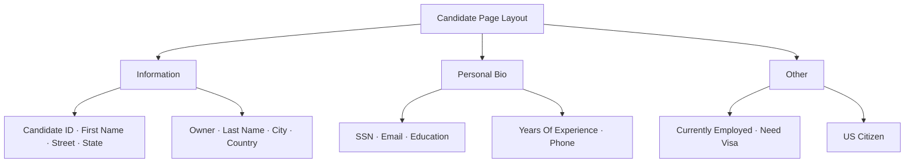

# Lesson 16 — Create Remaining Candidate Fields — Experience, Education & Eligibility

## Lesson Summary

In this lesson, we continue building the **Candidate Object** by adding the remaining candidate-related fields.

This lesson completes the Candidate profile by capturing:
- **Years of Experience**
- **SSN**
- **Education**
- **Employment Status**
- **Citizenship**
- **Visa Requirement**

These fields help recruiters evaluate candidate qualifications and eligibility before proceeding in the hiring process.

---

## Key Points

- Continue Candidate Object development.
- Add **Years of Experience** (Number field).
- Create **Encrypted Text** (SSN field).
- Configure **Education Picklist** (single-select values).
- Create **Checkbox fields** (Employment, Citizenship, Visa).
- Complete the candidate information data model.
- Creating a field does **not** automatically make it visible — you must add it to the **Page Layout** manually.

---

## Navigation — Create Candidate Fields

**Navigation Path:**
```
Gear Icon → Setup → Object Manager → Candidate → Fields & Relationships → New
```

**Alternative Navigation:**
```
Setup → Schema Builder → Candidate Object
```

**Purpose:** Complete the Candidate object schema.

---

## Detailed Notes

### Candidate Object — Final Field Specification

Below is the complete field specification for the Candidate object. The contact and address fields are created in [Lesson 14 — Create Candidate Custom Object](Lesson%2014%20—%20Create%20Candidate%20Custom%20Object%20%28Recruiting%20Application%29.md#steps--process--create-initial-candidate-fields-part-1), while the qualification and eligibility fields are created in this lesson.

Candidate Information:

| Field Name | Data Type | Purpose / Description |
| --- | --- | --- |
| **First Name** | Text (50) | Candidate's given name |
| **Last Name** | Text (50) | Candidate's family name |
| **Phone** | Phone | Contact number |
| **Email** | Email | Contact email |
| **Street** | Text (50) | Address street |
| **City** | Text (50) | Address city |
| **State** | Picklist | Address state |
| **Postal Code** | Text (15) | ZIP/postal code |
| **Country** | Text (20) | Address country |
| **Years Of Experience** | Number (2) | Total years of industry experience |
| **SSN** | Encrypted Text | Social Security Number |
| **Education** | Picklist | Highest level of education |
| **Are you currently Employed?** | Checkbox | Employment status check |
| **Are you US citizen?** | Checkbox | Citizenship status check |
| **Do you need Visa?** | Checkbox | Work authorization check |

---

### Candidate Object Architecture



---

## Steps / Process — Create Remaining Candidate Fields

### Step 1 — Create Years Of Experience

1. Go to **Object Manager → Candidate → Fields & Relationships → New**.
2. Select **Number** as the data type.
3. Configure:

| Property | Value |
| --- | --- |
| **Field Label** | Years Of Experience |
| **Length** | 2 |
| **Decimal Places** | 0 |

4. Click **Save**.

**Result:** The field `Years_Of_Experience__c` is created.

**Purpose:** Store candidate's total industry experience.

**Examples:** `3` · `12` · `25`

---

### Step 2 — Create SSN

1. Select **Encrypted Text** as the data type.
2. Configure:

| Property | Value |
| --- | --- |
| **Field Label** | SSN |
| **Length** | 9 (or as required for SSN formats) |
| **Mask Type** | Mask All (or Mask last four digits) |
| **Mask Character** | `*` (default) |

3. Click **Save**.

**Result:** The field `SSN__c` is created.

**Purpose:** Protect candidate's sensitive Social Security Number using encryption.

**Example Output:** `***-***-4567`

---

### Step 3 — Create Education

1. Select **Picklist** as the data type.
2. Configure:

| Property | Value |
| --- | --- |
| **Field Label** | Education |

3. Add the following picklist values (one per line):
   - `HS Diploma`
   - `BA/BS`
   - `MA/MS/MBA`
   - `Ph.D.`
   - `Post Doc`

4. Click **Save**.

**Result:** The field `Education__c` is created.

**Purpose:** Capture candidate's highest completed level of education.

---

### Step 4 — Create Employment Status

1. Select **Checkbox** as the data type.
2. Configure:

| Property | Value |
| --- | --- |
| **Field Label** | Are you currently Employed? |
| **Default Value** | Unchecked |

3. Click **Save**.

**Result:** The field `Currently_Employed__c` is created.

---

### Step 5 — Create Citizenship Field

1. Select **Checkbox** as the data type.
2. Configure:

| Property | Value |
| --- | --- |
| **Field Label** | Are you US citizen? |
| **Default Value** | Unchecked |

3. Click **Save**.

**Result:** The field `US_Citizen__c` is created.

---

### Step 6 — Create Visa Requirement

1. Select **Checkbox** as the data type.
2. Configure:

| Property | Value |
| --- | --- |
| **Field Label** | Do you need Visa? |
| **Default Value** | Unchecked |

3. Click **Save**.

**Result:** The field `Need_Visa__c` is created.

---

## Navigation — Update Candidate Page Layout

> [!IMPORTANT]
> Fields created in Schema Builder are **not** automatically placed on the layout. You must add them manually.

**Navigation Path:**
```
Setup → Object Manager → Candidate → Page Layouts → Candidate Layout → Edit
```

**Purpose:** This opens the **Page Layout Editor** where you can arrange fields into sections.

---

## Steps / Process — Configure Candidate Page Layout

Salesforce separates field creation from field visibility:

```
Object → Fields → Page Layout → Record UI
```

The final Candidate page is organized into **3 sections**.

---

### Step 1 — Create the Information Section

1. From the left palette, drag a **Section** element into the layout.
2. Configure:

| Property | Value |
| --- | --- |
| **Section Name** | Information |
| **Layout** | 2 Columns |

3. Click **OK**.
4. Arrange fields into the section:

| Left Side | Right Side |
| --- | --- |
| Candidate ID | Owner |
| First Name | Last Name |
| Street | City |
| State | Country |

> **Notes:**
> - Candidate ID → Auto Number field
> - Owner → Standard field
> - Information section appears first on the record

---

### Step 2 — Create the Personal Bio Section

1. Drag a second **Section** element into the layout.
2. Configure:

| Property | Value |
| --- | --- |
| **Section Name** | Personal Bio |
| **Layout** | 2 Columns |

3. Click **OK**.
4. Arrange fields into the section:

| Left Side | Right Side |
| --- | --- |
| SSN | Years Of Experience |
| Email | Phone |
| Education | *(empty)* |

> **Notes:**
> - SSN appears encrypted (e.g., `XXX-XX-4567`)
> - Education uses a Picklist
> - Years Of Experience uses a Number field

---

### Step 3 — Create the Other Section

1. Drag a third **Section** element into the layout.
2. Configure:

| Property | Value |
| --- | --- |
| **Section Name** | Other |
| **Layout** | 2 Columns |

3. Click **OK**.
4. Arrange fields into the section:

| Left Side | Right Side |
| --- | --- |
| Are you currently Employed? | Are you US citizen? |
| Do you need Visa? | *(empty)* |

> **Note:** Checkbox values display as `✓ Checked` or `☐ Unchecked`.

---

### Step 4 — Save the Layout

1. Click **Quick Save** to save without exiting.
2. Click **Save** to finalize.

---

### Candidate Page Layout — Final Structure



---

### Final Candidate UI Result

```
Candidate
├── Information
│   ├── Candidate ID        Owner
│   ├── First Name          Last Name
│   ├── Street              City
│   └── State               Country
├── Personal Bio
│   ├── SSN                 Years Of Experience
│   ├── Email               Phone
│   └── Education
└── Other
    ├── Currently Employed  US Citizen
    └── Need Visa
```

---

## Example Candidate Record

| Field | Value |
| --- | --- |
| **Candidate ID** | C-00001 |
| **First Name** | John |
| **Last Name** | Smith |
| **Years Of Experience** | 6 |
| **Education** | MA/MS/MBA |
| **Currently Employed** | ✓ Yes |
| **US Citizen** | ☐ No |
| **Need Visa** | ✓ Yes |

---

## Important Terms

| Term | Meaning |
| --- | --- |
| **Number Field** | Stores numeric values; supports length and decimal configuration |
| **Encrypted Text** | Masks sensitive data (e.g., SSN) in the UI using a mask character |
| **Picklist** | Dropdown allowing a single value selection from a predefined list |
| **Checkbox** | Binary flag holding True/False (Yes/No) values |
| **Candidate Object** | Custom object capturing job applicant profile data |
| **Page Layout** | Configuration determining which fields and sections are visible on a record |

---

## Commands / Syntax / Configuration

### Create Field
```
Setup → Object Manager → Candidate → Fields & Relationships → New
```

### Edit Page Layout
```
Setup → Object Manager → Candidate → Page Layouts → Candidate Layout → Edit
```

### Full Workflow
```
Create Field → Configure → Save → Open Page Layout → Add Field to Section → Quick Save → Save
```

---

## Certification Focus

### Important for Exam

- **Number vs. Text:** Use **Number** for metrics that may need calculations (e.g., Years of Experience).
- **Security:** Use **Encrypted Text** to safeguard sensitive PII like SSN or credit card numbers.
- **Picklist vs. Checkbox:** Use **Picklist** for a single selection from multiple choices; use **Checkbox** for binary True/False checks.
- **Field Visibility:** Creating a field does **not** make it visible on a record — you must add it to the **Page Layout**.

### Common Exam Traps

| Scenario | Correct Action |
| --- | --- |
| Field exists but is not visible on record | Add it to the Page Layout |
| Need better field grouping | Add a Section to the Layout |
| Want to reorder fields on the record | Edit the Page Layout |
| Using Text field for SSN | Switch to Encrypted Text |
| Expected Schema Builder fields on layout | Manually add them — they don't auto-appear |

---

## Real-World Application

Candidate objects help companies:
- Track applicant qualifications, experience levels, and certifications.
- Filter candidate eligibility dynamically using checkbox fields.
- Safeguard candidate Personally Identifiable Information (PII) using Encrypted Text.
- Support fast, data-backed hiring decisions.

---

## Quick Revision (30 sec)

- Added **Years Of Experience** (Number).
- Added **SSN** (Encrypted Text).
- Added **Education** (Picklist).
- Added **Currently Employed** (Checkbox).
- Added **US Citizen** (Checkbox).
- Added **Need Visa** (Checkbox).
- Opened **Candidate Layout** in the Page Layout Editor.
- Created 3 sections: **Information**, **Personal Bio**, **Other**.
- Placed all fields into the appropriate sections.
- Saved the layout using **Quick Save** → **Save**.
- Verified the final Candidate Object configuration.