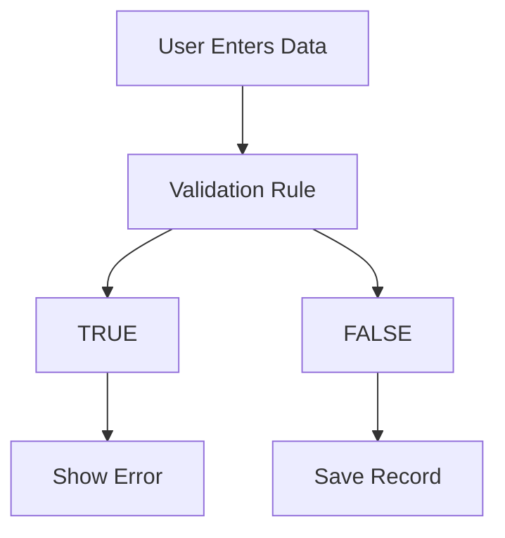
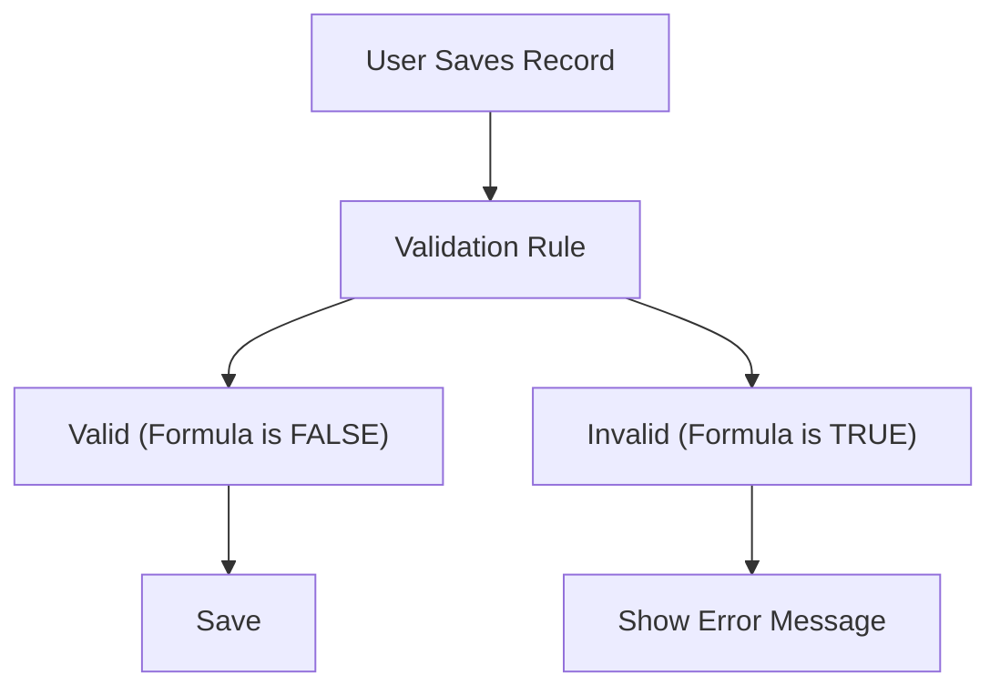

# Lesson 17 — Introduction to Validation Rules in Salesforce

## Lesson Summary

In this lesson, we are introduced to **Validation Rules** in Salesforce.

Validation Rules ensure that users enter **valid, high-quality data** before records are saved into Salesforce. 

Instead of allowing incorrect or incomplete information into the database, Salesforce checks defined conditions and prevents saving when data does not meet business requirements.

This lesson explains:
- What Validation Rules are
- Why they are important
- Formula-based validation logic
- Error messages
- Real business examples
- Validation scenarios that will be implemented in upcoming lessons

---

## Key Points

- Validation Rules maintain **data quality** by preventing invalid information from entering records.
- They execute **before the save** operation.
- They are built using **formulas**.
- Formula evaluation returns:
  - **TRUE** → Validation triggers (displays error, blocks save)
  - **FALSE** → Validation passes (allows save)
- Custom error messages can be displayed either at the top of the page or next to a specific field.

---

## Navigation — Create Validation Rule

**Navigation Path:**
```
Gear Icon → Setup → Object Manager → [Select Object] → Validation Rules → New
```

**Example:**
```
Setup → Object Manager → Position → Validation Rules → New
```

**Purpose:** Create rules that verify data correctness before a record is saved to the database.

---

## Detailed Notes

### What is a Validation Rule?

Validation Rules verify that users enter data according to defined business standards.

**Validation Lifecycle:**
```
User Input → Validation Rule Runs → Valid?
                                     ├── YES → Save Record
                                     └── NO → Show Error
```

**Validation Prevents:**
- ❌ Junk Data
- ❌ Invalid Values
- ❌ Wrong Formats
- ❌ Impossible Conditions

---

### Why Validation Rules Are Important

Without validation rules, users can enter inconsistent or impossible data.

**Example 1: Candidate Name**
- **Invalid Input:** `First Name: 123456`
- **Expected Input:** `First Name: John`
- **Behavior:** The validation rule blocks numbers in name fields.

**Example 2: Position Salary**
- **Invalid Input:** `Min Pay: 70000` / `Max Pay: 50000`
- **Expected Input:** `Min Pay: 50000` / `Max Pay: 70000` (Minimum must be less than or equal to Maximum)
- **Behavior:** Minimum cannot exceed Maximum.

---

### Validation Rule Architecture



---

### How Validation Rules Work

Validation Rules are based on logical formulas:

| Formula Result | Meaning | Action |
| --- | --- | --- |
| **TRUE** | Validation condition met (Invalid Data) | Block Save & Show Error |
| **FALSE** | Validation condition not met (Valid Data) | Allow Save |

> [!IMPORTANT]
> Validation formulas are written to detect **invalid conditions**, not valid ones. The formula defines what should **not** be allowed.

---

### Validation Components

Every validation rule contains:

| Component | Purpose / Description |
| --- | --- |
| **Rule Name** | Validation identifier (API-style name) |
| **Formula** | Logical expression used to catch invalid data |
| **Error Message** | The custom feedback shown to users when validation fails |
| **Error Location** | Where the message appears (Top of Page or Field-specific) |

**Example:**
- **Requirement:** Maximum Pay cannot exceed 1 Million.
- **Formula:** `Max_Pay__c > 1000000`
- **Error Message:** "Maximum Pay cannot exceed 1 Million."

---

### Example Validation Scenarios

#### Example 1 — Required Field
- **Requirement:** `First Name` cannot be blank.
- **Rule:** Error if empty.

#### Example 2 — Invalid Characters
- **Fields:** `First Name`, `Last Name`
- **Rule:** Numbers or symbols not allowed.
- **Valid:** `John`, `Smith`
- **Invalid:** `John123`, `@John`

#### Example 3 — Phone Format
- **Requirement:** Phone must follow company format.
- **Valid:** `999-999-9999`
- **Invalid:** `ABCD`

#### Example 4 — Date Validation
- **Requirement:** `Close Date` must be after `Open Date`.
- **Valid:** Open: 10 May, Close: 15 May
- **Invalid:** Open: 15 May, Close: 10 May

#### Example 5 — Percentage Validation
- **Requirement:** `Discount` must be less than or equal to the allowed percentage.
- **Rule:** Prevent `90%` if the limit is `20%`.

---

## Steps / Process — Validation Rules We Will Build Next

This lesson introduces the upcoming validations we will configure in future modules.

### Validation Rule 1 — Minimum Pay ≤ Maximum Pay
- **Object:** `Position`
- **Requirement:** `Minimum Pay < Maximum Pay`
- **Invalid Input:** `Min: 70000` · `Max: 50000`
- **Error Message:** `Minimum Pay cannot exceed Maximum Pay.`

---

### Validation Rule 2 — Close Date Required
- **Requirement:** If `Status = Closed`, then `Close Date` is required.
- **Invalid Input:** `Status: Closed` · `Close Date: (blank)`
- **Error Message:** `Close Date is required.`

---

### Validation Rule 3 — Close Date After Open Date
- **Requirement:** `Close Date > Open Date`
- **Invalid Input:** `Open: 10 May` · `Close: 8 May`
- **Error Message:** `Close Date must be after Open Date.`

---

### Validation Rule 4 — Maximum Pay Limit
- **Requirement:** `Maximum Pay ≤ 1,000,000`
- **Invalid Input:** `Max: 10,000,000`
- **Error Message:** `Maximum Pay cannot exceed 1 Million.`

---

### Validation Rule 5 — Citizen vs Visa Logic
- **Object:** `Candidate`
- **Fields:** `US Citizen`, `Need Visa`
- **Business Rule:**
  - **Allowed:** US Citizen `✓ Checked` · Need Visa `☐ Unchecked`
  - **Allowed:** US Citizen `☐ Unchecked` · Need Visa `✓ Checked`
  - **Invalid:** US Citizen `✓ Checked` · Need Visa `✓ Checked`
- **Error Message:** `Select either Citizen OR Visa Required.`

---

### Validation Rule Flow



---

## Important Terms

| Term | Meaning |
| --- | --- |
| **Validation Rule** | A Salesforce feature that evaluates a formula before saving a record to ensure clean data. |
| **Formula** | Logical expression written to identify invalid data entry conditions. |
| **Error Message** | Feedback displayed to the user explaining why their data was rejected. |
| **TRUE** | Formula result meaning validation has triggered (invalid entry). |
| **FALSE** | Formula result meaning validation has not triggered (valid entry). |
| **Data Quality** | The accuracy, completeness, and reliability of the database records. |

---

## Commands / Syntax / Configuration

### Open Validation Rules
```
Setup → Object Manager → [Select Object] → Validation Rules
```

### Create Rule
```
New → Enter Rule Name → Write Formula → Add Error Message → Save
```

---

## Certification Focus

### Important for Exam

- **Execution Order:** Validation rules execute **before save**.
- **Formula Logic:** Formula must return **TRUE** to trigger the error, and **FALSE** to allow saving the record.
- **Usage:** Always use validation rules to enforce business requirements and maintain database integrity.

### Common Mistakes

- **Valid vs. Invalid:** Writing a formula for the *valid* condition instead of the *invalid* condition.
- **Error Message:** Forgetting to write an error message or choosing the wrong error location.
- **Wrong Fields:** Comparing mismatched fields or logical types.
- **Save Trigger:** Forgetting that validation runs before Salesforce saves the record.

### Remember
```
Create Rule → Write Formula (TRUE = Error) → Add Error Message → Save & Test
```

---

## Real-World Application

Validation Rules are used to:
- Prevent incorrect salaries (e.g., minimum salary > maximum salary).
- Enforce date validation logic (e.g., close date must be in the future, or after open date).
- Verify formatting of fields (e.g., SSN, phone numbers, postal codes).
- Validate customer records depending on status or stage.
- Protect data quality for downstream business intelligence and reporting.

---

## Quick Revision (30 sec)

- **Validation Rules** check data validity and execute **before save**.
- **Formula returns TRUE** → Validation triggers, displaying a custom error message and blocking the save.
- **Formula returns FALSE** → Record is saved successfully.
- Prevent junk data, invalid values, wrong formats, and impossible conditions.
- Upcoming validations include Position and Candidate field checks (e.g., Min vs. Max Pay, Close Date checks, Citizen vs. Visa logic).
- Crucial for Salesforce Administrator certification concepts and exam questions.