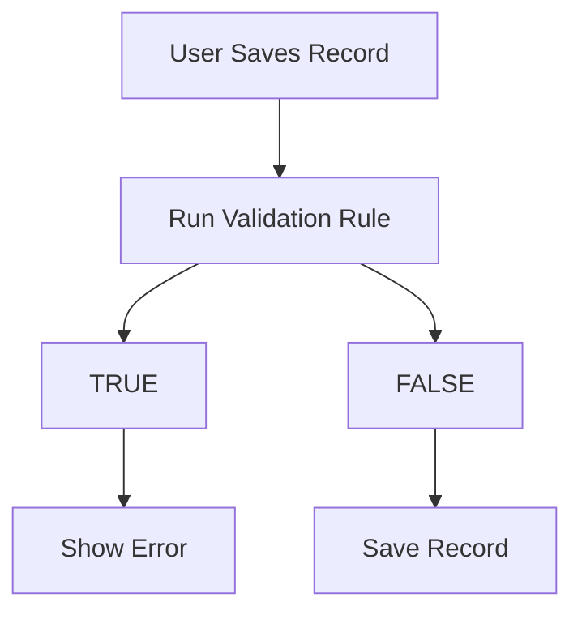
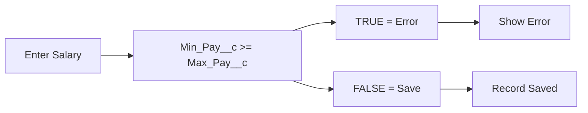

# Lesson 18 — Create First Validation Rule (Min Pay Cannot Be Greater Than Max Pay)

## Lesson Summary

In this lesson, we create our **first Validation Rule** in Salesforce.

The goal is to ensure that **Minimum Pay is always less than Maximum Pay** in the **Position Object**.

Without validation, Salesforce allows invalid salary values to be saved. Validation Rules prevent bad data by checking conditions before records are stored.

This lesson introduces:
- Creating Validation Rules
- Writing validation formulas
- Displaying error messages
- Testing validation behavior

---

## Key Points

- Validation Rules prevent invalid data from being saved.
- Validation formulas define **error conditions**.
- Formula returning **TRUE = Error**.
- Error messages guide users to correct records.
- Validation executes during record creation and editing.

---

## Navigation — Create Validation Rule

### Method 1 — From Position Record
```
Position Tab → Gear Icon → Edit Object → Validation Rules → New
```

### Method 2 — From Setup (Recommended)
```
Gear Icon → Setup → Object Manager → Position → Validation Rules → New
```

---

## Detailed Notes

### Problem Before Validation Rule

Currently, users can save invalid data.

**Example:**

| Field | Value |
| --- | --- |
| **Position** | Business Analyst |
| **Min Pay** | 90,000 |
| **Max Pay** | 60,000 |

This should not be allowed because **Minimum Pay must always be less than Maximum Pay**. However, Salesforce allows saving because no validation rule exists yet.

---

## Steps / Process — Create Validation Rule

### Step 1 — Open Validation Rules

Navigate to:
```
Setup → Object Manager → Position → Validation Rules → New
```

---

### Step 2 — Configure Rule Information

Configure the following fields:

| Property | Value |
| --- | --- |
| **Rule Name** | Max_Pay_Greater_Than_Min_Pay |
| **Active** | Checked |
| **Description** | Maximum Pay should always be greater than Minimum Pay |

> [!NOTE]
> Rule names in Salesforce must not contain spaces or special characters except underscores.

---

### Step 3 — Write Error Condition Formula

Enter the following validation formula:
```
Min_Pay__c >= Max_Pay__c
```

Then click **Check Syntax**. If configured correctly, it will display:
```
No syntax errors found
```

---

### Formula Explanation

```
Min_Pay__c >= Max_Pay__c
```

**Logical Behavior:**
- If **Minimum Pay is greater than or equal to Maximum Pay**, the formula evaluates to **TRUE**.
- A result of **TRUE** triggers the **Error Message** and blocks the save.
- A result of **FALSE** allows the record to save.

> [!IMPORTANT]
> Validation Rules are written for the **invalid condition** (what is NOT allowed).
> - ❌ **Wrong (Valid Condition):** `Min_Pay__c < Max_Pay__c`
> - ✅ **Correct (Invalid Condition):** `Min_Pay__c >= Max_Pay__c`
> 
> **Rule of Thumb:** `Validation Formula = Error Condition`

---

### Step 4 — Configure Error Message

Configure the message and display location:

- **Error Message:** `Minimum Pay cannot be greater than Maximum Pay.`
- **Error Location:** `Top of Page` *(Alternative: Field level, next to Max Pay or Min Pay)*

---

### Step 5 — Save Validation Rule

1. Click **Save**.
2. Verify that **Active = TRUE** is checked. If it is inactive, the validation rule will not execute.

---

### Validation Rule Flow



---

## Testing Validation Rule

### Test Case 1 — Invalid Data
- **Input:** Min Pay = `90,000` | Max Pay = `60,000`
- **Result:** ❌ Save blocked
- **Error:** `Minimum Pay cannot be greater than Maximum Pay.`

---

### Test Case 2 — Equal Values
- **Input:** Min Pay = `40,000` | Max Pay = `40,000`
- **Result:** ❌ Save blocked
- **Reason:** The formula uses `>=`. Equal values are also invalid since minimum pay should be strictly less than maximum pay.

---

### Test Case 3 — Valid Data
- **Input:** Min Pay = `90,000` | Max Pay = `160,000`
- **Result:** ✅ Record Saved successfully

---

## Validation Rule Architecture



---

## Important Terms

| Term | Meaning |
| --- | --- |
| **Validation Rule** | Formula-based logic that prevents users from saving invalid data. |
| **Formula** | The logical condition Salesforce checks to evaluate data validity. |
| **Error Message** | The custom text displayed to users to explain why saving was blocked. |
| **Check Syntax** | Salesforce utility that checks validation formulas for compile errors. |
| **Active Rule** | A flag indicating whether the validation rule is currently running. |

---

## Commands / Syntax / Configuration

### Validation Formula
```
Min_Pay__c >= Max_Pay__c
```

### Error Message
```
Minimum Pay cannot be greater than Maximum Pay.
```

### Navigation
```
Setup → Object Manager → Position → Validation Rules
```

---

## Certification Focus

### Important for Exam

- **Execution Order:** Validation Rules execute **before save**.
- **Formula Logic:** `TRUE = Error`, `FALSE = Save`.
- **Target Conditions:** Validation formulas must target the **invalid conditions** to block bad inputs.

### Common Mistakes

- Writing a formula that identifies valid data instead of invalid data.
- Forgetting to check the **Active** checkbox.
- Referencing the wrong field API names (always use the field inserter).
- Skipping the syntax check during rule creation.
- Using `>` (greater than) instead of `>=` (greater than or equal to), which would let users save identical min and max pay.

---

## Real-World Application

Validation Rules are commonly used for:
- **Salary validation** (Min vs. Max comparisons)
- **Discount limits** (preventing sales reps from offering too high of a discount)
- **Date comparisons** (Close date after open date)
- **Required conditions** (requiring fields based on picklist choices)
- **Data quality** (blocking special characters or formatting checks)
- **Financial controls** (enforcing approval limits or budget ranges)

---

## Quick Revision (30 sec)

- **Object:** Created first Validation Rule on the **Position Object**.
- **Formula:** Used `Min_Pay__c >= Max_Pay__c` (checks for invalid condition).
- **Behavior:** `TRUE` triggers the error message, `FALSE` allows the save.
- **Save Location:** Configured to show the error message at the **Top of Page**.
- **Testing:** Verified that invalid values and equal values are blocked, while valid values save successfully.