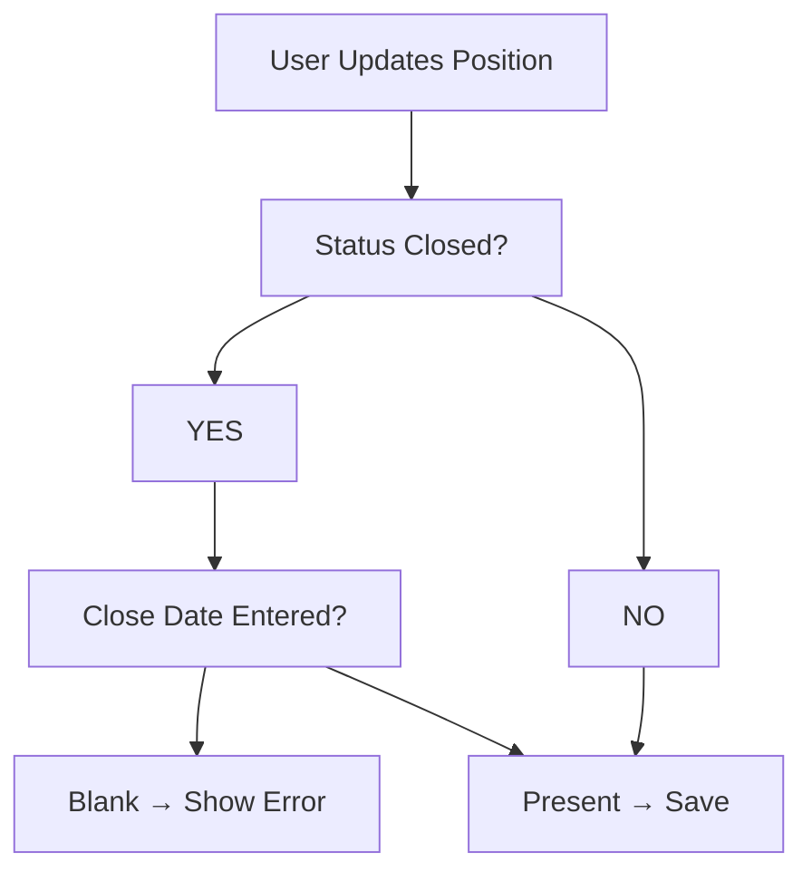

# Lesson 19 — Create Second Validation Rule (Close Date Required When Position Status Is Closed)

## Lesson Summary

In this lesson, we create the **second Validation Rule** for the **Position Object**.

The objective is to ensure that whenever a position status changes to a **Closed status** (specifically `Closed - Cancelled` for this first step), the **Close Date** becomes mandatory.

This prevents incomplete records from entering Salesforce and ensures dependent business processes can run correctly.

We also introduce:
- **ISPICKVAL()**
- **ISBLANK()**
- **AND()**
- Displaying errors on a specific field

---

## Key Points

- Validation depends on **Position Status**.
- **Close Date is conditionally required**.
- Validation triggers only for selected statuses.
- Use **ISPICKVAL()** for Picklists.
- Use **ISBLANK()** for empty fields.
- Use **AND()** to combine conditions.

---

## Business Requirement

- **Condition:** If Position Status becomes `Closed - Cancelled`.
- **Requirement:** `Close Date` must be entered.
- **Action:** Otherwise, the record cannot be saved.

---

## Navigation — Create Validation Rule

```
Gear Icon → Setup → Object Manager → Position → Validation Rules → New
```

**Alternative Navigation:**
```
Position Tab → Gear Icon → Edit Object → Validation Rules → New
```

---

## Detailed Notes

### Problem Before Validation

Current behavior:

Users can save the following invalid combination:

| Position Status | Close Date |
| --- | --- |
| Closed - Cancelled | *(blank)* |

This creates:
- Missing closure records.
- Workflow failures.
- Reporting inaccuracies.

---

### Validation Logic

**Rule:**
```
IF Status = "Closed - Cancelled" AND Close Date is blank
THEN Show Error
```

---

### Validation Rule Flow



---

## Steps / Process — Create Validation Rule

### Step 1 — Open Validation Rules

Navigate to:
```
Setup → Object Manager → Position → Validation Rules → New
```

---

### Step 2 — Configure Rule

Enter the following configuration:

| Property | Value |
| --- | --- |
| **Rule Name** | Close_Date_Required_When_Status_Closed |
| **Active** | Checked |
| **Description** | Close Date required whenever status becomes closed |

---

### Step 3 — Create Error Formula

Enter the following validation formula:
```
AND(
    ISPICKVAL(Status__c, "Closed - Cancelled"),
    ISBLANK(Close_Date__c)
)
```

Click **Check Syntax**. If configured correctly, it will display:
```
No syntax errors found
```

---

### Formula Breakdown

#### ISPICKVAL()
Checks whether a Picklist contains a specific value.
- **Syntax:** `ISPICKVAL(picklist_field, text_literal)`
- **Example:** `ISPICKVAL(Status__c, "Closed - Cancelled")` returns **TRUE** when the status is "Closed - Cancelled".

#### ISBLANK()
Checks if a field is empty.
- **Syntax:** `ISBLANK(expression)`
- **Example:** `ISBLANK(Close_Date__c)` returns **TRUE** when the date is missing.

#### AND()
Combines multiple conditions.
- **Syntax:** `AND(logical1, logical2, ...)`
- **Example:** `AND(Condition1, Condition2)` returns **TRUE** only if both Condition1 and Condition2 are TRUE.

---

### Step 4 — Configure Error Message

Configure the error message details:

- **Error Message:** `Please provide Close Date or correct Status.`
- **Error Location:** `Field: Status` *(Note: Choosing "Field" displays the error right below the field instead of at the top of the page).*

---

### Step 5 — Save Validation Rule

1. Click **Save**.
2. Ensure **Active = TRUE** is checked.

---

## Testing Validation Rule

### Test Case 1 — Invalid
- **Input:** Status = `Closed - Cancelled` | Close Date = *(blank)*
- **Result:** ❌ Save Blocked
- **Error:** `Please provide Close Date or correct Status.`

---

### Test Case 2 — Valid
- **Input:** Status = `Closed - Cancelled` | Close Date = `25-Jun`
- **Result:** ✅ Record Saved

---

### Example Scenario

1. Position is created for **Scrum Master**.
2. User changes Status to **Closed - Cancelled** and leaves Close Date **blank**.
3. User clicks Save → **Validation Error** is triggered.
4. User enters **Close Date = 25-Jun** and clicks Save → **Save Success**.

---

## Important Note — Multiple Formula Styles

The same logic can be written using different syntax styles:

**Style 1 (Standard Logical Functions):**
```
AND(ISPICKVAL(Status__c, "Closed - Cancelled"), ISBLANK(Close_Date__c))
```

**Style 2 (Comparison Operators):**
```
ISPICKVAL(Status__c, "Closed - Cancelled") && ISBLANK(Close_Date__c)
```

Both styles produce the identical result.

---

## Current Limitation

This validation currently only checks for the status:
```
Closed - Cancelled
```

It does **not** yet handle other closed statuses:
- `Closed - Filled`
- `Closed - Not Approved`

We will enhance the validation rule to support multiple closed statuses in the next lesson.

---

## Important Terms

| Term | Meaning |
| --- | --- |
| **Validation Rule** | Salesforce logic that prevents saving records with invalid data. |
| **ISPICKVAL** | Salesforce function that checks picklist values. |
| **ISBLANK** | Salesforce function that checks for empty fields. |
| **AND** | Logical operator requiring all conditions to evaluate to true. |
| **Error Location** | Option to show errors either at the top of the page or next to a specific field. |

---

## Commands / Syntax / Configuration

### Validation Formula
```
AND(ISPICKVAL(Status__c, "Closed - Cancelled"), ISBLANK(Close_Date__c))
```

### Navigation
```
Setup → Object Manager → Position → Validation Rules
```

---

## Certification Focus

### Important for Exam

- **Picklist Validation:** You cannot compare a Picklist field directly to text (e.g., `Status__c = "Closed"` is invalid). You must use **ISPICKVAL()**.
- **Blank Checks:** Use **ISBLANK()** for checking empty fields instead of comparing to null.
- **Multiple Conditions:** Use **AND()** to combine multiple requirements.
- **Logic Rule:** Validation formulas define **error conditions** (TRUE = Error).

### Common Mistakes

- Comparing Picklist fields directly using `=` instead of using `ISPICKVAL()`.
- Forgetting to check if the field is empty using `ISBLANK()`.
- Missing comma separators inside the `AND()` function.
- Rule is left inactive after creation.
- Using wrong picklist value API names.

---

## Real-World Application

Used to:
- Ensure recruitment and hiring workflows are followed correctly.
- Enforce process completion by requiring closure details.
- Maintain reporting accuracy by having accurate close dates.
- Prevent incomplete recruitment records from polluting reports.

---

## Quick Revision (30 sec)

- **Object:** Validation rule created on **Position Object**.
- **Functions:** Combined `ISPICKVAL()`, `ISBLANK()`, and `AND()`.
- **Condition:** Made Close Date conditionally required if Status is set to **Closed - Cancelled**.
- **UI:** Displayed field-level errors (below Status field).
- **Next Step:** Prepared the schema to be expanded for multi-status validation.