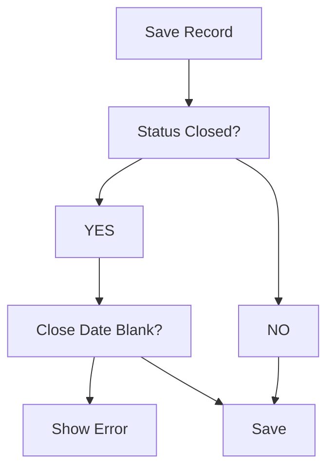

# Lesson 20 — Update Validation Rule (Require Close Date for Multiple Closed Statuses)

## Lesson Summary

In this lesson, we update the validation rule created in Lesson 19.

Previously, the validation only required **Close Date** when:
```
Status = Closed - Cancelled
```

Now we enhance the rule so that **Close Date becomes mandatory for all closed statuses**. 

The validation should trigger when Position Status is any of the following:
- `Closed - Cancelled`
- `Closed - Filled`
- `Closed - Not Approved`

This lesson introduces:
- Updating existing Validation Rules
- Using **OR()**
- Combining **AND() + OR()**
- Multiple **ISPICKVAL()** conditions

---

## Key Points

- Existing Validation Rules can be edited and updated in Salesforce.
- Multiple Picklist values can be validated in a single rule.
- **OR()** evaluates to TRUE if any of its inner conditions are true.
- **AND()** combines grouped conditions.
- Always use the **API values** of picklist fields in formulas, not the UI labels.

---

## Business Requirement

- **Conditions:** 
  - Position Status becomes `Closed - Cancelled` OR `Closed - Filled` OR `Closed - Not Approved`
  - AND `Close Date` is left blank.
- **Action:** ❌ Record should NOT save.

---

## Navigation — Edit Validation Rule

### Method 1
```
Setup → Object Manager → Position → Validation Rules → Close_Date_Required_When_Status_Closed → Edit
```

### Alternative
```
Position Record Page → Gear Icon → Edit Object → Validation Rules → Click Edit on the rule
```

---

## Detailed Notes

### Problem with Previous Validation

The validation created in Lesson 19 only checked for `Closed - Cancelled`. 

This meant users could still save the following incomplete records:

| Status | Close Date |
| --- | --- |
| Closed - Filled | *(blank)* |
| Closed - Not Approved | *(blank)* |

To prevent this data gap, we must validate all closed states.

---

### Verify Status API Values

Before editing the formula, verify the exact API values of the picklist fields:
```
Setup → Object Manager → Position → Fields & Relationships → Status
```

Open the **Status** field and check the **API Value** column. Always copy the API value directly instead of typing UI labels, as they may differ (e.g. spaces, spelling, or casing).

---

### Closed Status Values

| Status Label | API Value |
| --- | --- |
| Closed - Cancelled | `Closed - Cancelled` |
| Closed - Filled | `Closed - Filled` |
| Closed - Not Approved | `Closed - Not Approved` |

---

## Steps / Process — Update Validation Rule

### Step 1 — Open Existing Validation Rule

1. Navigate to:
   ```
   Setup → Object Manager → Position → Validation Rules
   ```
2. Open **Close_Date_Required_When_Status_Closed**.
3. Click **Edit**.

---

### Step 2 — Replace Existing Formula

**Old Formula:**
```
AND(
    ISPICKVAL(Status__c, "Closed - Cancelled"),
    ISBLANK(Close_Date__c)
)
```

**Updated Formula:**
```
AND(
    OR(
        ISPICKVAL(Status__c, "Closed - Cancelled"),
        ISPICKVAL(Status__c, "Closed - Filled"),
        ISPICKVAL(Status__c, "Closed - Not Approved")
    ),
    ISBLANK(Close_Date__c)
)
```

---

### Formula Breakdown

#### OR()
Checks multiple values. Returns **TRUE** if any one condition is met.
- **Syntax:** `OR(Condition1, Condition2, ...)`

#### AND()
Combines the closed status check and the missing date check.
- **Syntax:** `AND(One of Closed Statuses is TRUE, Close Date is Blank)`

#### ISPICKVAL()
Checks if picklist fields contain the selected values.
- **Example:** `ISPICKVAL(Status__c, "Closed - Filled")`

#### ISBLANK()
Checks if a field (like Close Date) is empty.
- **Example:** `ISBLANK(Close_Date__c)`

---

### Step 3 — Validate Formula

Click **Check Syntax** to verify the updated formula.
- **Expected Result:** `No syntax errors found`

---

### Step 4 — Configure Error Message

- **Error Message:** `Please provide Close Date or correct Status.`
- **Error Location:** `Field: Status` *(Alternative: Top of Page)*

---

### Step 5 — Save Validation Rule

1. Click **Save**.
2. Verify that **Active = TRUE** is still checked.

---

### Validation Logic Flow



---

## Testing Validation Rule

### Test Case 1 — Invalid (Closed - Filled)
- **Input:** Status = `Closed - Filled` | Close Date = *(blank)*
- **Result:** ❌ Error displayed, Save blocked.

---

### Test Case 2 — Invalid (Closed - Not Approved)
- **Input:** Status = `Closed - Not Approved` | Close Date = *(blank)*
- **Result:** ❌ Error displayed, Save blocked.

---

### Test Case 3 — Invalid (Closed - Cancelled)
- **Input:** Status = `Closed - Cancelled` | Close Date = *(blank)*
- **Result:** ❌ Error displayed, Save blocked.

---

### Test Case 4 — Valid
- **Input:** Status = `Closed - Filled` | Close Date = `25-Jun`
- **Result:** ✅ Record saved successfully.

---

## Alternate Formula Style

The exact same logical checks can also be written using operator syntax:
```
(
    ISPICKVAL(Status__c, "Closed - Cancelled") || 
    ISPICKVAL(Status__c, "Closed - Filled") || 
    ISPICKVAL(Status__c, "Closed - Not Approved")
) 
&& ISBLANK(Close_Date__c)
```

Both styles evaluate identically in Salesforce.

---

## Important Terms

| Term | Meaning |
| --- | --- |
| **OR** | Logical operator returning TRUE if any parameter is true. |
| **AND** | Logical operator returning TRUE only if all parameters are true. |
| **ISPICKVAL** | Salesforce formula function to evaluate picklist values. |
| **ISBLANK** | Salesforce formula function to check for empty values. |
| **Validation Rule** | System automation checking criteria to prevent poor data saves. |

---

## Commands / Syntax / Configuration

### Validation Formula
```
AND(
    OR(
        ISPICKVAL(Status__c, "Closed - Cancelled"),
        ISPICKVAL(Status__c, "Closed - Filled"),
        ISPICKVAL(Status__c, "Closed - Not Approved")
    ),
    ISBLANK(Close_Date__c)
)
```

### Navigation
```
Setup → Object Manager → Position → Validation Rules
```

---

## Certification Focus

### Important for Exam

- **Evaluating Multiple Picklist Values:** You cannot use `ISPICKVAL()` with `OR` inside it like `ISPICKVAL(Status__c, "A" || "B")`. You must evaluate each individually inside `OR()`: `OR(ISPICKVAL(Status__c, "A"), ISPICKVAL(Status__c, "B"))`.
- **Function Nesting:** Know how to combine `AND()`, `OR()`, `ISPICKVAL()`, and `ISBLANK()` functions properly.
- **Rule Purpose:** Ensure validation rules are used to enforce business validation logic before saving.

### Common Mistakes

- Using UI labels instead of exact API values.
- Nesting `OR()` incorrectly inside `AND()`.
- Leaving the Close Date field unvalidated because `ISBLANK()` was omitted.
- Modifying the wrong validation rule instead of updating the existing one.
- Forgetting to keep the rule **Active**.

---

## Real-World Application

Used to:
- Prevent incomplete hiring closures and data discrepancies.
- Enforce business and recruitment workflows.
- Improve dashboard and analytics reporting accuracy.
- Maintain database consistency and standard operational procedures.

---

## Quick Revision (30 sec)

- **Action:** Updated existing Validation Rule on **Position Object**.
- **Expansion:** Added support for validating multiple closed statuses using `OR()`.
- **Functions Used:** combined `OR()`, `AND()`, `ISPICKVAL()`, and `ISBLANK()`.
- **Logic:** Requires a `Close Date` when the position transitions into any closed status.
- **Testing:** Confirmed all invalid Closed Statuses without Close Date are blocked, and valid inputs pass.