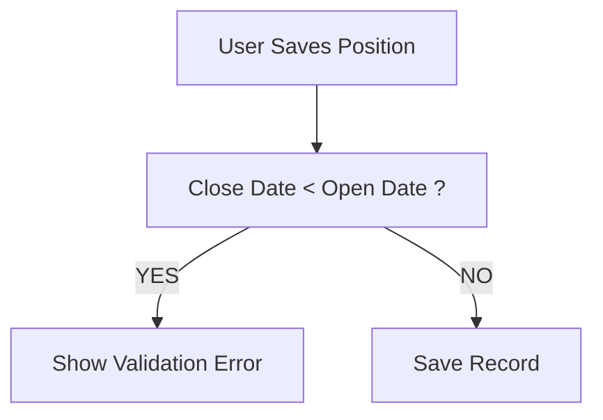

# Lesson 21 — Create Third Validation Rule (Close Date Must Be After Open Date)

## Lesson Summary

In this lesson, we create the **third Validation Rule** for the **Position Object**.

The objective is to ensure that a **Position cannot be closed before it was opened**. 

This validation guarantees logical date relationships and prevents invalid records from entering Salesforce.

We create a rule that validates:
- **Close Date**
- **Open Date**
- Date comparison using operators
- Error conditions in Validation Rules

---

## Key Points

- Close Date must always occur **after** Open Date.
- Validation Rules compare field values before saving.
- Date fields can be compared directly.
- Validation formulas define **invalid conditions**.
- Prevent inconsistent business records.

---

## Business Requirement

- **Condition:** If `Close Date < Open Date`
- **Action:** ❌ Record should NOT save.
- **Reason:** A position cannot close before it opens.

---

## Navigation — Create Validation Rule

### Method 1
```
Gear Icon → Setup → Object Manager → Position → Validation Rules → New
```

### Alternative
```
Position Record → Gear Icon → Edit Object → Validation Rules → New
```

---

## Detailed Notes

### Problem Before Validation

Current behavior allows users to save invalid dates.

**Example:**

| Open Date | Close Date |
| --- | --- |
| 31-May | 28-May |

Salesforce saves the record, but logically:
- ❌ Position closed before opening.

This creates:
- Incorrect hiring timelines.
- Reporting errors.
- Bad historical data.
- Broken business processes.

---

### Validation Logic

**Rule:**
```
IF Close Date < Open Date THEN Show Error
```

---

### Validation Rule Flow



---

## Steps / Process — Create Validation Rule

### Step 1 — Open Validation Rules

Navigate to:
```
Setup → Object Manager → Position → Validation Rules → New
```

---

### Step 2 — Configure Rule

Enter the following configuration:

| Property | Value |
| --- | --- |
| **Rule Name** | Close_Date_Cannot_Be_Before_Open_Date |
| **Active** | Checked |
| **Description** | Prevent closing a position before open date |

---

### Step 3 — Create Error Formula

Enter the following validation formula:
```
Close_Date__c < Open_Date__c
```

Click **Check Syntax**. If configured correctly, it will display:
```
No syntax errors found
```

---

### Formula Breakdown

#### Close_Date__c
Represents the Position Close Date custom field.

#### Open_Date__c
Represents the Position Open Date custom field.

#### Comparison Operator (<)
Checks: "Is Close Date earlier than Open Date?"
- Returns **TRUE** → Triggers error message, blocks save.
- Returns **FALSE** → Validation passes, record is saved.

---

### Step 4 — Configure Error Message

- **Error Message:** `Close Date cannot be before Open Date.`
- **Error Location:** `Top of Page`

Click **Save** and ensure that **Active = TRUE** is checked.

---

## Testing Validation Rule

### Test Case 1 — Invalid

| Open Date | Close Date |
| --- | --- |
| 31-May | 28-May |

- **Result:** ❌ Save Blocked
- **Error:** `Close Date cannot be before Open Date.`

---

### Test Case 2 — Valid

| Open Date | Close Date |
| --- | --- |
| 31-May | 23-Jun |

- **Result:** ✅ Record Saved

---

## Example Scenario

1. Position is created for **Salesforce Admin**.
2. User enters:
   - **Open Date:** `28-May`
   - **Close Date:** `27-May`
3. User clicks Save → **Validation Error** is triggered.
4. User corrects:
   - **Close Date:** `30-May`
5. User clicks Save → **Saved** successfully.

---

## Important Terms

| Term | Meaning |
| --- | --- |
| **Validation Rule** | System check that prevents saving invalid records. |
| **Date Comparison** | Evaluating two dates to check their chronological order. |
| **Error Condition Formula** | Formula that defines what is disallowed (evaluates to TRUE on error). |
| **Open Date** | Custom date field indicating when the position becomes active. |
| **Close Date** | Custom date field indicating when the position becomes inactive. |

---

## Commands / Syntax / Configuration

### Validation Formula
```
Close_Date__c < Open_Date__c
```

### Navigation
```
Setup → Object Manager → Position → Validation Rules
```

---

## Certification Focus

### Important for Exam

- **Direct Comparisons:** Date comparisons do **not** require functions. You can directly compare them using operators:
  ```
  DateField1__c < DateField2__c
  ```
- **Error Targets:** Always write the formula to target the **invalid conditions** (TRUE = Error).

### Common Mistakes

- Reversing the comparison operator (e.g. using `>` instead of `<`).
- Writing the valid condition instead of the error condition.
- Forgetting to check the **Active** checkbox on the validation rule.
- Referencing the wrong API names for the custom date fields.

---

## Real-World Application

Used to:
- Maintain valid and logical recruitment timelines.
- Prevent inconsistent historical records.
- Improve accuracy for analytics and dashboards.
- Enforce standard business policies regarding date entries.

---

## Quick Revision (30 sec)

- **Action:** Created third Validation Rule on **Position Object**.
- **Operator:** Used `<` to compare Close Date and Open Date directly.
- **Formula:** `Close_Date__c < Open_Date__c`
- **Outcome:** Prevented saving records when Close Date is earlier than Open Date.
- **Validation:** Tested and confirmed that chronological consistency is enforced.