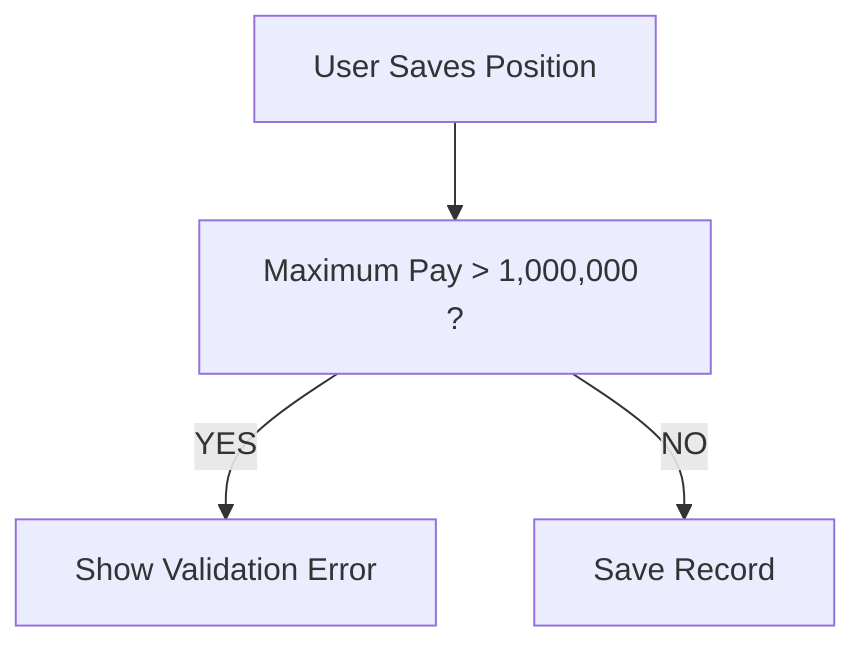

# Lesson 22 — Create Fourth Validation Rule (Maximum Pay Cannot Be Greater Than 1 Million)

## Lesson Summary

In this lesson, we create another Validation Rule for the **Position Object**.

The objective is to ensure that **Maximum Pay cannot exceed $1,000,000**.

Although Salesforce field length already restricts how many digits users can enter, business rules may require additional validation to restrict values within acceptable limits.

This lesson introduces:
- Numeric validation
- Comparing Currency fields
- Error messages on specific fields
- Difference between **Field Length Validation** and **Validation Rules**

---

## Key Points

- Field length controls **how many digits** users can enter.
- Validation Rules control **business logic**.
- Maximum Pay should never exceed **1 million**.
- Validation formulas define **error conditions**.
- Errors can be displayed directly beside fields.

---

## Business Requirement

- **Condition:** If `Maximum Pay > 1000000`
- **Action:** ❌ Prevent Save
- **Reason:** Company policy does not allow salary greater than 1 million.

---

## Navigation — Create Validation Rule

### Method 1
```
Gear Icon → Setup → Object Manager → Position → Validation Rules → New
```

### Alternative
```
Position Record → Gear Icon → Edit Object → Validation Rules → New
```

---

## Detailed Notes

### Understanding Length vs Validation Rule

When we created fields earlier:

| **Field** | **Length** |
| --- | --- |
| Min Pay | 7 |
| Max Pay | 8 |

Field Length determines:
```
How many characters users can enter
```

**Example:**

#### Min Pay (Length = 7)

Allowed:
```
9999999
```

Not Allowed:
```
99999999
```

Salesforce automatically throws:
```
Value outside allowed range
```

But length validation alone is not enough.

Business Rule:
```
Maximum Pay ≤ 1,000,000
```

---

### Validation Logic

**Rule:**
```
IF Maximum Pay > 1000000 THEN Show Error
```

---

### Validation Rule Flow



---

## Steps / Process — Create Validation Rule

### Step 1 — Open Validation Rules

Navigate to:
```
Setup → Object Manager → Position → Validation Rules → New
```

---

### Step 2 — Configure Rule

Enter the following configuration:

| **Property** | **Value** |
| --- | --- |
| **Rule Name** | Max_Pay_Cannot_Be_Greater_Than_1_Million |
| **Active** | Checked |
| **Description** | Prevent salaries greater than 1 million |

---

### Step 3 — Create Error Formula

Validation Formula:
```
Max_Pay__c > 1000000
```

Click **Check Syntax**. If configured correctly, it will display:
```
No syntax errors found
```

---

### Formula Breakdown

#### Max_Pay__c
Represents the Maximum Pay custom field.

#### Comparison Operator (>)
Checks: "Is Maximum Pay greater than 1 million?"
- Returns **TRUE** → Triggers error message, blocks save.
- Returns **FALSE** → Validation passes, record is saved.

---

### Step 4 — Configure Error Message

- **Error Message:** `Maximum Pay cannot be greater than 1 million.`
- **Error Location:** `Field → Max Pay`

Click **Save** and ensure that **Active = TRUE** is checked.

---

## Testing Validation Rule

### Test Case 1 — Invalid

| **Max Pay** |
| --- |
| 1000001 |

- **Result:** ❌ Save Blocked
- **Error:** `Maximum Pay cannot be greater than 1 million.`

---

### Test Case 2 — Invalid

| **Max Pay** |
| --- |
| 9000000 |

- **Result:** ❌ Save Blocked

---

### Test Case 3 — Valid

| **Max Pay** |
| --- |
| 999999 |

- **Result:** ✅ Record Saved

---

### Test Case 4 — Boundary Value

| **Max Pay** |
| --- |
| 1000000 |

- **Result:** ✅ Record Saved
- **Reason:** Validation only checks **Greater than**, NOT **Greater than or equal to**.

---

## Existing Validation Rules Created So Far

| **Validation Rule** | **Purpose** |
| --- | --- |
| Max Pay ≥ Min Pay | Prevent invalid salary range |
| Close Date Required | Mandatory for closed positions |
| Close Date > Open Date | Valid timeline |
| Max Pay ≤ 1 Million | Salary cap |

---

## Important Terms

| **Term** | **Meaning** |
| --- | --- |
| **Validation Rule** | Prevent invalid data |
| **Currency Field** | Stores monetary values |
| **Error Condition Formula** | Condition that triggers error |
| **Field Length** | Controls digit limit |
| **Business Validation** | Controls allowed values |

---

## Commands / Syntax / Configuration

### Validation Formula
```
Max_Pay__c > 1000000
```

### Navigation
```
Setup → Object Manager → Position → Validation Rules
```

---

## Certification Focus

### Important for Exam

Remember:
```
Field Length ≠ Business Validation
```

- **Length:** How many digits can be entered.
- **Validation:** Whether the value is allowed according to business logic.
- **Validation formulas define:**
  - ❌ **Error conditions** (TRUE triggers error)
  - NOT
  - ✅ **Valid conditions**

---

### Common Mistakes

- Confusing field length with business validation.
- Using the wrong comparison operator (e.g. `<` instead of `>`).
- Forgetting to activate the validation rule.
- Displaying the error message on the wrong field or location.

---

## Real-World Application

Used to:
- Prevent accidental salary entries.
- Enforce company compensation policy.
- Improve reporting accuracy.
- Maintain financial controls.

---

## Quick Revision (30 sec)

- **Action:** Created fourth Validation Rule on the **Position Object**.
- **Operator:** Used `>` operator to validate Maximum Pay.
- **Formula:** `Max_Pay__c > 1000000`
- **Location:** Displayed as a field-level error on Maximum Pay.
- **Concept:** Learned the difference between field length and validation rules.
- **Outcome:** Tested boundary values and successfully prevented invalid compensation entries.