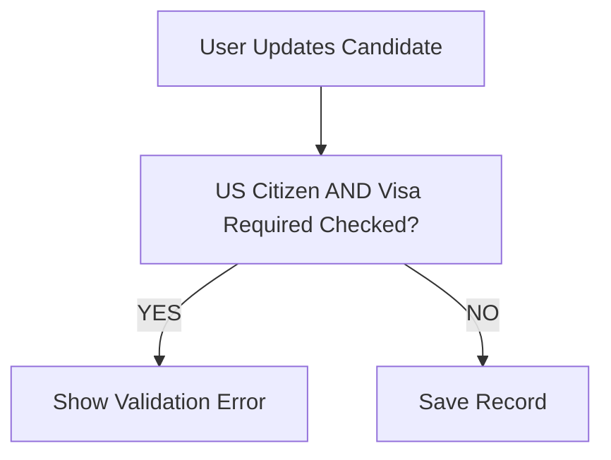
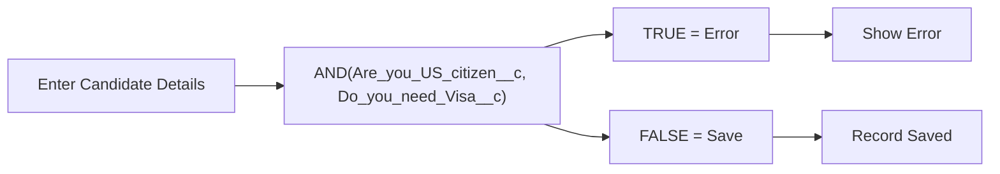

# Lesson 23 — Create Final Validation Rule (US Citizen and Visa Required Cannot Both Be Selected)

## Lesson Summary

In this lesson, we create the final Validation Rule for the **Candidate Object**.

The objective is to prevent contradictory candidate information from being saved.

If a candidate is marked as a **US Citizen**, then **Visa Required** should not also be selected.

This lesson introduces:
- Validation using **Checkbox fields**
- Boolean logic (**TRUE / FALSE**)
- Using **AND()**
- Preventing contradictory business data

---

## Key Points

- Validation is created on the **Candidate Object**.
- Two Checkbox fields are validated:
  - **Are_you_US_citizen__c**
  - **Do_you_need_Visa__c**
- Both checkboxes cannot be selected together.
- Validation formulas return **TRUE → Error**.
- Helps maintain high-quality recruitment data.

---

## Business Requirement

- **Condition:** If `US Citizen = Checked` AND `Need Visa = Checked`
- **Action:** ❌ Prevent Save
- **Reason:** Candidate cannot simultaneously be a US citizen and require a visa.

---

## Navigation — Create Validation Rule

### Method 1
```
Gear Icon → Setup → Object Manager → Candidate → Validation Rules → New
```

### Alternative
```
Candidate Record → Gear Icon → Edit Object → Validation Rules → New
```

---

## Detailed Notes

### Problem Before Validation

Current behavior:

| **US Citizen** | **Need Visa** | **Result** |
| --- | --- | --- |
| ✔ | ✔ | Record Saves |

This creates:
- Contradictory candidate information.
- Incorrect recruitment data.
- Reporting inaccuracies.
- Invalid business decisions.

---

### Validation Logic

**Rule:**
```
IF US Citizen = TRUE AND Need Visa = TRUE THEN Show Error
```

---

### Validation Rule Flow



---

## Steps / Process — Create Validation Rule

### Step 1 — Open Validation Rules

Navigate to:
```
Setup → Object Manager → Candidate → Validation Rules → New
```

---

### Step 2 — Configure Rule

Enter the following configuration:

| **Property** | **Value** |
| --- | --- |
| **Rule Name** | US_Citizen_And_Visa_Validation |
| **Active** | Checked |
| **Description** | Candidate cannot be US citizen and require visa together |

---

### Step 3 — Create Error Formula

Validation Formula:
```
AND(Are_you_US_citizen__c, Do_you_need_Visa__c)
```

Click **Check Syntax**. If configured correctly, it will display:
```
No syntax errors found
```

---

### Formula Breakdown

#### Are_you_US_citizen__c
Represents the **Are you US Citizen?** checkbox field.
- Returns **TRUE** when checked.
- Returns **FALSE** when unchecked.

#### Do_you_need_Visa__c
Represents the **Do you Need Visa?** checkbox field.
- Returns **TRUE** when checked.
- Returns **FALSE** when unchecked.

#### AND()
Returns **TRUE** only when all inner conditions are TRUE:
```
US Citizen = Checked (TRUE) AND Need Visa = Checked (TRUE)
```
When it returns TRUE, a validation error is thrown and the save is blocked.

---

### Alternative Formula Style

The instructor also showed another equivalent style:
```
Are_you_US_citizen__c && Do_you_need_Visa__c
```

Both formulas behave the same. However, the preferred readable version is:
```
AND(Are_you_US_citizen__c, Do_you_need_Visa__c)
```

---

### Step 4 — Configure Error Message

- **Error Message:** `If you are a US Citizen then Visa Required is not allowed and vice versa.`
- **Error Location:** `Top of Page` *(You may also display it beside a field.)*

---

### Step 5 — Save Validation Rule

1. Click **Save**.
2. Ensure that **Active = TRUE** is checked.

---

## Testing Validation Rule

### Test Case 1 — Invalid
- **Input:** US Citizen = `Checked` | Need Visa = `Checked`
- **Result:** ❌ Save Blocked
- **Error:** `If you are a US Citizen then Visa Required is not allowed and vice versa.`

---

### Test Case 2 — Valid
- **Input:** US Citizen = `Checked` | Need Visa = `Unchecked`
- **Result:** ✅ Record Saved successfully

---

### Test Case 3 — Valid
- **Input:** US Citizen = `Unchecked` | Need Visa = `Checked`
- **Result:** ✅ Record Saved successfully

---

### Test Case 4 — Valid
- **Input:** US Citizen = `Unchecked` | Need Visa = `Unchecked`
- **Result:** ✅ Record Saved successfully

---

## Candidate Validation Architecture



---

## Validation Rules Created So Far

| **Validation Rule** | **Object** |
| --- | --- |
| Max Pay ≥ Min Pay | Position |
| Close Date Required | Position |
| Close Date After Open Date | Position |
| Max Pay ≤ 1 Million | Position |
| US Citizen vs Visa | Candidate |

---

## Important Terms

| **Term** | **Meaning** |
| --- | --- |
| **Validation Rule** | System check that prevents users from saving invalid records. |
| **Checkbox Field** | A custom field type that stores Boolean value data (TRUE for checked, FALSE for unchecked). |
| **AND()** | A logical function in Salesforce validation rules that returns TRUE only if all arguments evaluate to TRUE. |
| **Boolean Logic** | A logic system using TRUE and FALSE evaluations to determine data validity. |
| **Error Condition** | The condition that triggers the validation error and blocks saving the record when it evaluates to TRUE. |

---

## Commands / Syntax / Configuration

### Validation Formula
```
AND(Are_you_US_citizen__c, Do_you_need_Visa__c)
```

### Navigation
```
Setup → Object Manager → Candidate → Validation Rules
```

---

## Certification Focus

### Important for Exam

- **Checkbox field values:** Checkbox fields are already evaluated as Boolean values (`TRUE`/`FALSE`). You do not need to compare them to TRUE.
  - ❌ **Inefficient:** `Are_you_US_citizen__c = TRUE`
  - ✅ **Recommended:** `Are_you_US_citizen__c`
- **Logical functions:** Use `AND()` when all conditions must be met for an error to trigger.
- **Validation Formula = Error Condition:** Keep in mind that validation formulas define what is **NOT allowed** (TRUE = Error).

### Common Mistakes

- Comparing Checkbox fields to TRUE or FALSE values explicitly in formulas.
- Using `OR()` instead of `AND()`, which would block saving if *either* checkbox is checked.
- Forgetting to check the **Active** checkbox on the Validation Rule.
- Writing validation rules that target valid conditions instead of error conditions.

---

## Real-World Application

Used to:
- Prevent contradictory data entry in hiring and candidate records.
- Improve screening efficiency by ensuring data integrity.
- Support accurate eligibility verification reporting.
- Maintain overall database cleanliness for HR metrics and downstream integrations.

---

## Quick Revision (30 sec)

- **Action:** Created the final Validation Rule on the **Candidate Object**.
- **Fields:** Validated two checkbox fields (`Are_you_US_citizen__c` and `Do_you_need_Visa__c`).
- **Function:** Used `AND()` to evaluate if both checkboxes are checked.
- **Formula:** `AND(Are_you_US_citizen__c, Do_you_need_Visa__c)`
- **Behavior:** Blocked saving when both checkboxes are selected, ensuring logical consistency.
- **Architecture:** Confirmed that checkbox fields can be used directly as boolean expressions in formulas.