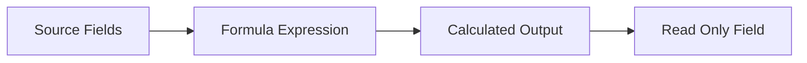
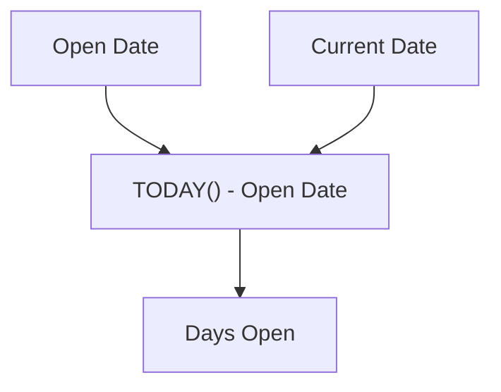
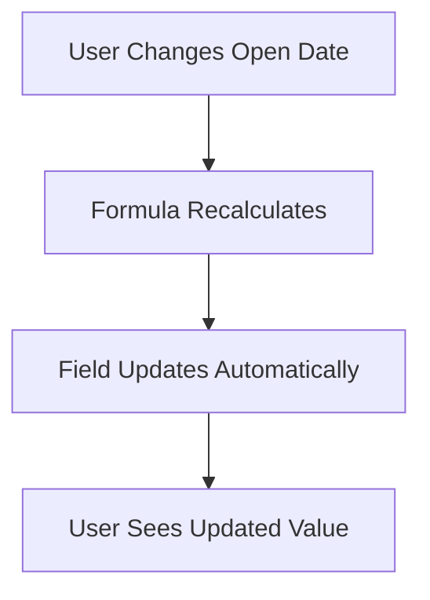

# Lesson 24 — Introduction to Formula Fields in Salesforce

## Lesson Summary

In this lesson, we learn about **Formula Fields** in Salesforce.

A Formula Field is a **read-only field** whose value is automatically calculated using a **formula expression**. Instead of users manually entering values, Salesforce calculates and updates the field dynamically.

Formula Fields are commonly used when values depend on other fields and should always stay synchronized automatically.

This lesson introduces:
- Formula Fields
- Read-only calculated fields
- Dynamic updates
- Formula expressions
- Business automation using calculations

---

## Key Points

- Formula Fields automatically calculate values.
- Formula Fields are always **read-only**.
- Values update automatically when source fields change.
- No manual editing is allowed.
- Formulas can depend on one or multiple fields.
- Common use cases:
  - Date calculations
  - Deadlines
  - Age calculations
  - Status indicators
  - Derived values

---

## What is a Formula Field?

A **Formula Field** is:

> A read-only field that derives its value using a formula expression.

Unlike normal fields:

| **Standard Field** | **Formula Field** |
| --- | --- |
| User enters value | Salesforce calculates value |
| Editable | Read-only |
| Stored manually | Generated dynamically |

---

## Formula Field Architecture



---

## Detailed Notes

### How Formula Fields Work

Formula fields depend on:

```
Source Fields + Formula Logic = Calculated Result
```

Whenever source data changes:

```
Salesforce recalculates automatically
```

No user action required.

---

### Example 1 — Number of Days Position Is Open

Suppose:

| **Field** | **Value** |
| --- | --- |
| Open Date | 30-May |
| Today | 05-Jun |

Formula:

```
TODAY() - Open_Date__c
```

Result:

```
6 Days
```

The value updates automatically every day.

---

### Example Flow



---

### Example 2 — Deadline Calculation

**Business Requirement:**

Every position must close within **30 days** after opening.

Input:

| **Field** | **Value** |
| --- | --- |
| Position Open Date | 01-Jun |

Formula:

```
Open_Date__c + 30
```

Result:

```
Deadline = 01-Jul
```

If Open Date changes:

```
Deadline changes automatically
```

---

### Formula Update Behavior

Formula Fields automatically refresh when:

| **Change** | **Formula Updates** |
| --- | --- |
| Source Field Updated | ✅ Yes |
| Record Edited | ✅ Yes |
| Formula Modified | ✅ Yes |
| Manual Input | ❌ No |

---

## Navigation — Create Formula Field

```
Gear Icon → Setup → Object Manager → Select Object → Fields & Relationships → New → Formula
```

---

## Steps / Process — Create Formula Field

### Step 1 — Open Object

Navigate to:
```
Setup → Object Manager
```

Choose:
```
Position
```

---

### Step 2 — Create New Field

Click:
```
Fields & Relationships → New
```

Select:
```
Formula
```

Click:
```
Next
```

---

### Step 3 — Configure Formula

Enter:

| **Property** | **Example** |
| --- | --- |
| Field Label | Days Open |
| Formula Return Type | Number |
| Decimal Places | 0 |

Click:
```
Next
```

---

### Step 4 — Write Formula

Example:
```
TODAY() - Open_Date__c
```

Click:
```
Check Syntax
```

Expected:
```
No syntax errors found
```

---

### Step 5 — Save

Click:
```
Save
```

Formula field becomes:
```
Read Only
```

---

### Formula Field Flow



---

## Important Characteristics

| **Property** | **Formula Field** |
| --- | --- |
| Editable | ❌ No |
| Calculated | ✅ Yes |
| Auto Updated | ✅ Yes |
| Stores Data | ❌ No |
| Depends On Other Fields | ✅ Yes |

---

## Formula Field Limits

Salesforce enforces two size limits on formula fields:

| **Limit** | **Value** | **What It Means** |
| --- | --- | --- |
| Text Size | 3,900 characters | The raw formula you write cannot exceed 3,900 characters |
| Compilation Size | 5,000 characters | The internally expanded version of your formula cannot exceed 5,000 characters |

### Text Size Limit — 3,900 Characters

The actual formula text you write in the editor cannot exceed **3,900 characters**.

> If your formula contains too many `IF()`, `CASE()`, `TEXT()` calls, etc., and the formula itself grows beyond 3,900 characters → **it will not save**.

### Compilation Limit — 5,000 Characters

Before executing, Salesforce internally expands (compiles) your formula — resolving referenced functions and fields.

> Even if your visible formula is under 3,900 characters, after compilation the expanded size may exceed **5,000 characters** → **save fails**.

**Key takeaway:** Both limits must be respected. A formula that passes the text limit can still fail at the compilation limit.

---

## Important Terms

| **Term** | **Meaning** |
| --- | --- |
| **Formula Field** | Read-only calculated field |
| **Source Field** | Input field used in formula |
| **Formula Expression** | Logic used to compute value |
| **Read Only** | Cannot be edited manually |
| **Dynamic Calculation** | Updates automatically |

---

## Commands / Syntax / Configuration

### Example Formulas

Calculate Days Open:
```
TODAY() - Open_Date__c
```

Calculate Deadline:
```
Open_Date__c + 30
```

### Navigation
```
Setup → Object Manager → Fields & Relationships → New → Formula
```

---

## Certification Focus

### Important for Exam

Remember:
```
Formula Fields are ALWAYS Read Only
```

Formula Fields:
- ✔ Calculate automatically
- ✔ Update dynamically

Formula Fields do **NOT**:
- ❌ Store editable values

### Common Mistakes

- Trying to edit formula fields manually
- Creating normal fields instead of formulas
- Forgetting formulas recalculate automatically
- Using formulas where user input is required

---

## Real-World Application

Formula Fields are used for:

- SLA deadline calculations
- Candidate age calculation
- Days since application submitted
- Opportunity expected revenue
- Payroll calculations
- Position closure deadlines

---

## Quick Revision (30 sec)

- Learned Formula Fields.
- Formula Fields are read-only.
- Values are calculated automatically.
- Source field changes trigger updates.
- Used date calculation examples.
- Formula fields reduce manual updates.
- Useful for dynamic business logic.
- Prepared for practical formula creation in next lesson.