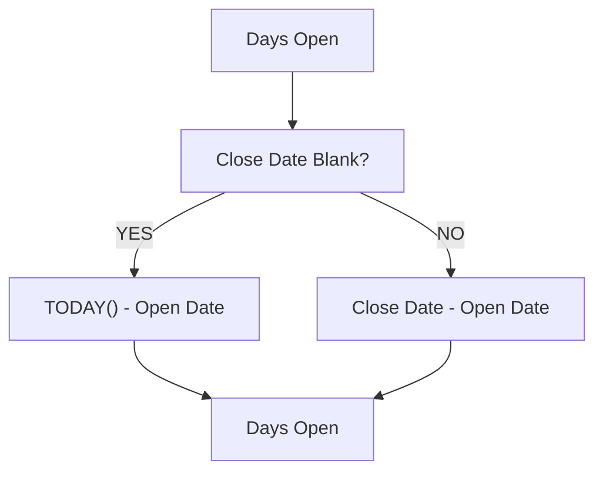

# Lesson 25 — Update Existing Formula Field (Days Open) — Add Close Date Logic

## Lesson Summary

In this lesson, we enhance the existing **Days Open** Formula Field created in the previous lesson.

Previously, the field calculated:

```
TODAY() - Open Date
```

That worked only for positions that remained open.

Now we improve the logic to support **closed positions**.

Updated behavior:
- If Position is still open → Calculate using **Today - Open Date**
- If Position is closed → Calculate using **Close Date - Open Date**

This creates a more accurate calculation of how long a position stayed open.

---

## Prerequisite

This lesson assumes:
- ✔ Position Object already exists
- ✔ Open Date field exists
- ✔ `Close_Date__c` exists
- ✔ Days Open Formula Field already created

---

## Key Points

- Modify existing Formula Field.
- Use `IF()` to introduce conditional logic.
- Use `ISBLANK()` to check whether Close Date exists.
- Keep Formula Field dynamic and read-only.
- Formula updates automatically when dates change.

---

## Business Requirement

Calculate actual duration the position remained open.

Logic:

### Position Still Open
```
TODAY() - Open Date
```

### Position Closed
```
Close Date - Open Date
```

---

## Navigation — Update Existing Formula

```
Gear Icon → Setup → Object Manager → Position → Fields & Relationships → Days Open → Edit
```

---

## Detailed Notes

### Existing Formula (From Previous Lesson)

Current Formula:
```
TODAY() - Open_Date__c
```

**Problem:** Once the position closes, this still continues counting days.

Example:

| **Open Date** | **Close Date** | **Current Result** |
| --- | --- | --- |
| 19-May | 26-May | 8 ❌ |

Expected:
```
7
```

Because:
```
26 - 19 = 7
```

---

### Updated Formula Logic

**Condition:**

```
If Close Date is Blank  → TODAY() - Open Date
Else                    → Close Date - Open Date
```

---

### Formula Flow



---

### Formula Explanation

#### ISBLANK()

Checks whether Close Date exists.

```
ISBLANK(Close_Date__c)
```

Returns:

| **Result** | **Meaning** |
| --- | --- |
| TRUE | Position still open |
| FALSE | Position closed |

#### IF()

Structure:
```
IF(condition, true_value, false_value)
```

Meaning:
- If condition is **TRUE** → use first calculation
- Otherwise → use second calculation

---

## Steps / Process — Update Days Open Formula

### Step 1 — Open Existing Formula Field

Navigate to:
```
Setup → Object Manager → Position → Fields & Relationships → Days Open → Edit
```

---

### Step 2 — Replace Existing Formula

Replace:
```
TODAY() - Open_Date__c
```

With:
```
IF(ISBLANK(Close_Date__c), TODAY() - Open_Date__c, Close_Date__c - Open_Date__c)
```

---

### Step 3 — Validate Formula

Click:
```
Check Syntax
```

Expected:
```
No syntax errors found
```

Click:
```
Save
```

---

## Testing Updated Formula

### Test Case 1 — Position Open

| **Open Date** | **Close Date** |
| --- | --- |
| 19-May | Blank |

Calculation:
```
TODAY() - 19-May
```

Result: ✅ Dynamic Days Open

---

### Test Case 2 — Position Closed

| **Open Date** | **Close Date** |
| --- | --- |
| 19-May | 26-May |

Calculation:
```
26 - 19
```

Result: ✅ 7 Days

---

### Test Case 3 — Position Closed Quickly

| **Open Date** | **Close Date** |
| --- | --- |
| 19-May | 21-May |

Result: ✅ 2 Days

---

## Important Note

Days Open remains:
- ✔ Formula Field
- ✔ Read-only
- ✔ Auto updated

Users cannot edit it manually.

---

## Final Formula

```
IF(ISBLANK(Close_Date__c), TODAY() - Open_Date__c, Close_Date__c - Open_Date__c)
```

---

## Important Terms

| **Term** | **Meaning** |
| --- | --- |
| **Formula Field** | Auto-calculated read-only field |
| **IF()** | Conditional function |
| **ISBLANK()** | Checks empty values |
| **TODAY()** | Returns current date |

---

## Commands / Syntax / Configuration

### Final Formula
```
IF(ISBLANK(Close_Date__c), TODAY() - Open_Date__c, Close_Date__c - Open_Date__c)
```

### Navigation
```
Setup → Object Manager → Position → Fields & Relationships → Days Open → Edit
```

---

## Certification Focus

### Important for Exam

Remember:
```
Date - Date = Number
```
```
Formula Fields = Read Only
```
```
IF(condition, true, false)
```

### Common Mistakes

- Forgetting to use `ISBLANK()` to check if Close Date has a value.
- Using `TODAY()` for closed positions instead of the actual Close Date.
- Treating formula fields as editable.
- Not checking syntax before saving the formula.

---

## Real-World Application

Used for:
- Position aging
- Recruitment reporting
- SLA tracking
- Deadline monitoring
- Escalation workflows

---

## Quick Revision (30 sec)

- Updated existing **Days Open** formula.
- Added support for **Close Date**.
- Used `IF()` for conditional logic.
- Used `ISBLANK()` to detect open positions.
- Kept Formula Field dynamic and read-only.
- Improved business accuracy of duration tracking.