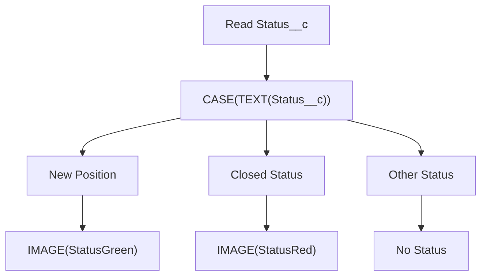
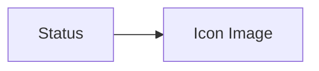

# Lesson 26 — Create Second Formula Field (Display Dynamic Status Icons)

## Lesson Summary

In this lesson, we create a **Formula Field that displays images dynamically** based on the Position Status.

Instead of showing only text values, Salesforce formula fields can also render **images/icons**.

We will:
- Upload images as **Static Resources**
- Create a **Formula Field**
- Use **CASE()**
- Use **TEXT()**
- Use **IMAGE()**
- Display different images depending on Position Status

Example:

| **Status** | **Icon** |
| --- | --- |
| New Position | 🟢 Green |
| Closed - Not Approved | 🔴 Red |
| Closed - Cancelled | 🔴 Red |
| Closed - Filled | 🔴 Red |
| Others | No Status |

---

## Key Points

- Formula Fields can return images.
- Images must be uploaded as Static Resources.
- `CASE()` works similar to IF-ELSE.
- `TEXT()` converts Picklist values to text.
- `IMAGE()` renders image output.
- Formula Fields remain **Read Only**.

---

## Business Requirement

Display a visual indicator based on Position Status.

Rules:
```
New Position     → Green Icon
Closed statuses  → Red Icon
Other statuses   → No Status
```

---

## Navigation — Upload Images

```
Gear Icon → Setup → Static Resources → New
```

---

## Steps / Process — Upload Static Resources

### Step 1 — Upload Green Check Image

> 📥 **Download:** [Green Check Icon — Flaticon](https://www.flaticon.com/free-icon/check_13983889)

Create:

| **Property** | **Value** |
| --- | --- |
| Name | StatusGreen |
| File | Downloaded green check icon |
| Cache Control | Public |

Click:
```
Save
```

---

### Step 2 — Upload Red Cross Image

> 📥 **Download:** [Red Cross Icon — Flaticon](https://www.flaticon.com/free-icon/cross_6711656)

Create:

| **Property** | **Value** |
| --- | --- |
| Name | StatusRed |
| File | Downloaded red cross icon |
| Cache Control | Public |

Click:
```
Save
```

Result — two Static Resources are now available:
```
StatusGreen
StatusRed
```

---

## Navigation — Create Formula Field

```
Setup → Object Manager → Position → Fields & Relationships → New → Formula
```

---

### Step 3 — Configure Formula Field

Field Configuration:

| **Property** | **Value** |
| --- | --- |
| Field Label | Icon Image |
| Return Type | Text |

Click:
```
Next
```

---

## Formula Logic

Use:
```
CASE(
  TEXT(Status__c),
  "New Position",        IMAGE("/resource/StatusGreen", "Green", 28, 28),
  "Closed - Not Approved", IMAGE("/resource/StatusRed",   "Red",   28, 28),
  "Closed - Cancelled",  IMAGE("/resource/StatusRed",   "Red",   28, 28),
  "Closed - Filled",     IMAGE("/resource/StatusRed",   "Red",   28, 28),
  "No Status"
)
```

Click:
```
Check Syntax
```

Expected:
```
No syntax errors found
```

Click:
```
Save
```

---

## Formula Explanation

### TEXT()

Converts a Picklist field value to a text string so `CASE()` can compare it.

```
TEXT(Status__c)
```

---

### CASE()

Works like IF-ELSE with multiple branches.

Structure:
```
CASE(expression, value1, result1, value2, result2, ..., default)
```

---

### IMAGE()

Displays an image in the field.

Structure:
```
IMAGE(image_url, alternate_text, width, height)
```

Example:
```
IMAGE("/resource/StatusGreen", "Green", 28, 28)
```

Parameters:

| **Parameter** | **Purpose** |
| --- | --- |
| URL | Path to the Static Resource image |
| Alternate Text | Text shown if image is unavailable |
| Width | Image width in pixels |
| Height | Image height in pixels |

---

### Formula Execution Flow



---

## Navigation — Add Formula Field to Layout

```
Setup → Object Manager → Position → Page Layouts → Position Layout
```

---

### Step 4 — Place Icon Field Next to Status

Drag:
```
Icon Image
```

Place beside:
```
Status
```

Click:
```
Save
```

---

## Testing

### Test 1 — New Position

| **Status** | **Expected** |
| --- | --- |
| New Position | 🟢 |

Result: ✅ Green image displayed

---

### Test 2 — Closed - Filled

| **Status** | **Expected** |
| --- | --- |
| Closed - Filled | 🔴 |

Result: ✅ Red image displayed

---

### Test 3 — Other Status (e.g. Pending Approval)

| **Status** | **Expected** |
| --- | --- |
| Pending Approval | No Status |

Result: ✅ Default text shown

---

## Final Layout



---

## Important Terms

| **Term** | **Meaning** |
| --- | --- |
| **Static Resource** | Uploaded files (images, scripts) available across Salesforce |
| **Formula Field** | Calculated read-only field |
| **CASE()** | Multiple-condition formula function |
| **IMAGE()** | Renders an image from a URL in a formula field |
| **TEXT()** | Converts a Picklist value to a text string |
| **StatusGreen** | Static Resource for the green check icon |
| **StatusRed** | Static Resource for the red cross icon |

---

## Commands / Syntax / Configuration

### Full Formula
```
CASE(
  TEXT(Status__c),
  "New Position",          IMAGE("/resource/StatusGreen", "Green", 28, 28),
  "Closed - Not Approved", IMAGE("/resource/StatusRed",   "Red",   28, 28),
  "Closed - Cancelled",    IMAGE("/resource/StatusRed",   "Red",   28, 28),
  "Closed - Filled",       IMAGE("/resource/StatusRed",   "Red",   28, 28),
  "No Status"
)
```

### Navigation
```
Setup → Static Resources → New
Setup → Object Manager → Position → Fields & Relationships → New → Formula
```

---

## Certification Focus

### Important for Exam

Remember:
```
Picklist → TEXT()
```
```
Multiple conditions → CASE()
```
```
Display images → IMAGE()
```
```
Formula Fields = Read Only
```

### Common Mistakes

- Using a Picklist value directly in `CASE()` without wrapping it in `TEXT()`.
- Misspelling the Static Resource name in the `IMAGE()` URL path.
- Forgetting the default (last) argument in `CASE()` — this is the fallback shown for unmatched values.
- Setting Return Type to something other than **Text** when using `IMAGE()`.

---

## Real-World Application

Used for:
- Position status indicators
- Approval dashboards
- SLA breach alerts
- Visual recruitment monitoring
- Escalation workflows

---

## Quick Revision (30 sec)

- Uploaded two images as Static Resources: `StatusGreen` and `StatusRed`.
- Created a Formula Field with return type **Text**.
- Used `TEXT()` to convert the Picklist field.
- Used `CASE()` to match status values.
- Used `IMAGE()` to render the correct icon.
- Default value `"No Status"` handles unmatched statuses.
- Added the field to the Position Page Layout beside Status.
- Tested all three scenarios: open, closed, and other.