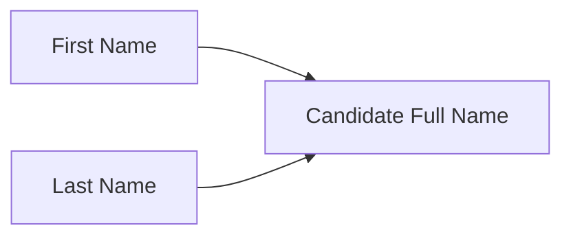
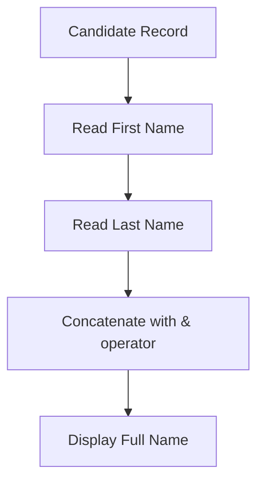

# Lesson 27 — Create Formula Field (Candidate Full Name)

## Lesson Summary

In this lesson, we create another Formula Field on the **Candidate Object**.

The objective is to automatically generate the **Candidate Full Name** by combining:
- First Name
- Last Name

Instead of asking users to manually enter a full name, Salesforce calculates it automatically.

This demonstrates one of the simplest and most common use cases of Formula Fields: **Text Concatenation**.

---

## Key Points

- Create a Formula Field on the Candidate Object.
- Formula derives its value from multiple source fields.
- Use the `&` operator to concatenate text.
- Formula Field remains **read-only**.
- Updates automatically whenever source fields change.

---

## Business Requirement

Currently Candidate records contain separate fields:

| **Field** | **Example** |
| --- | --- |
| First Name | Deepika |
| Last Name | Khanna |

**Requirement:** Automatically generate a combined full name.

Example output:

| **First Name** | **Last Name** | **Candidate Full Name** |
| --- | --- | --- |
| Deepika | Khanna | Deepika Khanna |
| John | Smith | John Smith |
| Rhea | Sane | Rhea Sane |

---

## Navigation — Create Formula Field

```
Gear Icon → Setup → Object Manager → Candidate → Fields & Relationships → New → Formula
```

---

## Candidate Object Flow



---

## Steps / Process — Create Candidate Full Name

### Step 1 — Open Candidate Object

Navigate to:
```
Setup → Object Manager → Candidate → Fields & Relationships
```

Click:
```
New
```

---

### Step 2 — Select Formula

Choose:
```
Formula
```

Click:
```
Next
```

---

### Step 3 — Configure Field

Field Configuration:

| **Property** | **Value** |
| --- | --- |
| Field Label | Candidate Full Name |
| Return Type | Text |

Click:
```
Next
```

---

### Step 4 — Write Formula

Enter:
```
First_Name__c & " " & Last_Name__c
```

Click:
```
Check Syntax
```

Expected:
```
No syntax errors found
```

Click:
```
Next
```

---

### Step 5 — Save Field

Set visibility:
```
Visible for all Profiles
```

Click:
```
Save
```

---

## Formula Explanation

Formula:
```
First_Name__c & " " & Last_Name__c
```

This joins three text values:

| **Part** | **Meaning** |
| --- | --- |
| `First_Name__c` | Candidate First Name field |
| `" "` | Literal blank space |
| `Last_Name__c` | Candidate Last Name field |

The `&` operator concatenates (joins) strings together.

Result:
```
First Name + Space + Last Name
```

---

### Why Add the Space?

**Without space:**
```
First_Name__c & Last_Name__c
```
Result: `DeepikaKhanna` ❌ Not readable.

**With space:**
```
First_Name__c & " " & Last_Name__c
```
Result: `Deepika Khanna` ✅ Clean and readable.

---

### Formula Execution Flow



---

## Add Field to Page Layout

Navigate to:
```
Setup → Object Manager → Candidate → Page Layouts → Candidate Layout
```

Drag:
```
Candidate Full Name
```

Place near:
```
First Name / Last Name
```

Click:
```
Save
```

---

## Testing

### Test 1

| **Field** | **Value** |
| --- | --- |
| First Name | Maneesh |
| Last Name | Malhotra |

Result:
```
Maneesh Malhotra
```

---

### Test 2

| **Field** | **Value** |
| --- | --- |
| First Name | Rhea |
| Last Name | Sane |

Result:
```
Rhea Sane
```

---

### Test 3

| **Field** | **Value** |
| --- | --- |
| First Name | John |
| Last Name | Doe |

Result:
```
John Doe
```

---

## Important Note

Candidate Full Name:
- ✔ Auto calculated
- ✔ Read-only
- ✔ Cannot be manually edited

Whenever First Name or Last Name changes:
```
Candidate Full Name updates automatically
```

---

## Important Terms

| **Term** | **Meaning** |
| --- | --- |
| **Formula Field** | Calculated read-only field |
| **Concatenation** | Combining multiple text values into one string |
| **`&` Operator** | Used to join text strings in Salesforce formulas |
| **Return Type** | The output data type of the formula (Text, Number, Date, etc.) |
| **Source Field** | The field whose value is used in the formula calculation |

---

## Commands / Syntax / Configuration

### Formula
```
First_Name__c & " " & Last_Name__c
```

### Navigation
```
Setup → Object Manager → Candidate → Fields & Relationships → New → Formula
```

---

## Certification Focus

### Important for Exam

Remember:
```
Text + Text → Use & to concatenate
```
```
Formula Fields = Read Only
```

Always include a `" "` (space) between name parts to ensure readable output.

### Common Mistakes

- Forgetting to add `" "` between first and last name — results in names without spaces.
- Using `+` instead of `&` for text concatenation (Salesforce uses `&` for text, not `+`).
- Setting Return Type to **Number** instead of **Text** for a name field.
- Trying to manually edit the formula field on a record.

---

## Real-World Application

Used for:
- Full Name generation
- Address formatting
- Display labels
- Invoice references
- Customer display names

---

## Quick Revision (30 sec)

- Created a Formula Field on the **Candidate Object**.
- Set Return Type to **Text**.
- Used `&` operator to concatenate First Name and Last Name.
- Added `" "` (blank space) between the two fields.
- Verified with **Check Syntax** — no errors.
- Added field to the Candidate Page Layout.
- Formula updates automatically when source fields change.