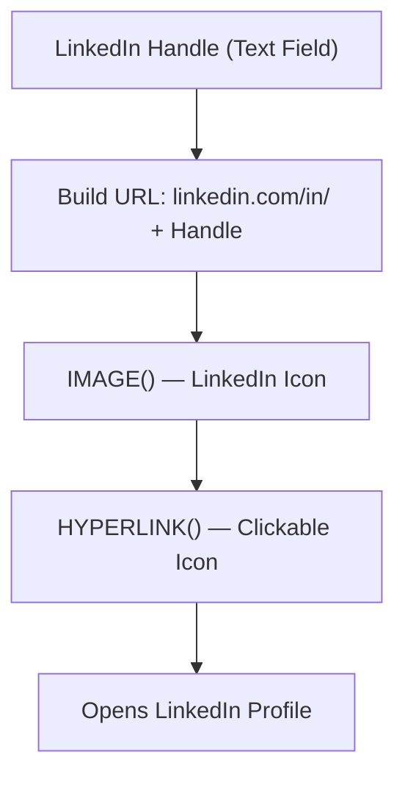

# Lesson 28 — Create Formula Field (Dynamic LinkedIn Profile Link Using Image)

## Lesson Summary

In this lesson, we create another Formula Field on the **Candidate Object**.

This formula field creates a **clickable LinkedIn icon** that opens the candidate's LinkedIn profile.

Instead of displaying the full LinkedIn URL, Salesforce shows a small LinkedIn logo. Clicking the image redirects users to the candidate's LinkedIn profile.

This lesson introduces:
- `HYPERLINK()` — creates a clickable link
- `IMAGE()` — displays an image as the link label
- Dynamic URL generation using field concatenation
- Static Resources for logo storage

---

## Key Points

- Create a **Text field** for the LinkedIn handle (username).
- Upload the LinkedIn logo as a **Static Resource**.
- Use a **Formula Field** to generate a clickable image link.
- Combine `HYPERLINK()` and `IMAGE()` in a single formula.
- The URL is built dynamically from the stored handle.

---

## Business Requirement

Recruiters want quick, one-click access to candidate LinkedIn profiles from within Salesforce.

| **Field** | **Value** |
| --- | --- |
| LinkedIn Handle | john-smith |

Displayed as:

> 🔵 LinkedIn Icon *(clickable)*

Clicking the icon opens:
```
https://www.linkedin.com/in/john-smith
```

---

## Navigation — Create LinkedIn Handle Field

```
Setup → Object Manager → Candidate → Fields & Relationships → New
```

---

## Steps / Process

### Step 1 — Create LinkedIn Handle Text Field

Select field type:
```
Text
```

Configure:

| **Property** | **Value** |
| --- | --- |
| Field Label | LinkedIn Handle |
| Length | 200 |

Click:
```
Save
```

API name created:
```
LinkedIn_Handle__c
```

---

### Step 2 — Upload LinkedIn Logo as Static Resource

Navigate to:
```
Setup → Static Resources → New
```

> 📥 **Download:** [LinkedIn Icon — Flaticon](https://www.flaticon.com/free-icon/linkedin_3991775)

Configure:

| **Property** | **Value** |
| --- | --- |
| Name | LinkedInIcon |
| File | Downloaded LinkedIn icon |
| Cache Control | Public |

Click:
```
Save
```

---

### Step 3 — Configure Formula Field

Navigate to:
```
Setup → Object Manager → Candidate → Fields & Relationships → New → Formula
```

Configure:

| **Property** | **Value** |
| --- | --- |
| Field Label | View LinkedIn Profile |
| Return Type | Text |

Click:
```
Next
```

---

### Step 4 — Write Formula

Enter:
```
HYPERLINK(
  "https://www.linkedin.com/in/" & LinkedIn_Handle__c,
  IMAGE("/resource/LinkedInIcon", "Connect on LinkedIn", 28, 28)
)
```

Click:
```
Check Syntax
```

Expected:
```
No syntax errors found
```

Click:
```
Save
```

> [!TIP]
> If the LinkedIn image is not visible immediately after saving, try refreshing the page a couple of times. Static Resource images can take a moment to propagate.

---

## Formula Explanation

### HYPERLINK()

Creates a clickable link.

Structure:
```
HYPERLINK(url, friendly_name)
```

Example:
```
HYPERLINK("https://www.linkedin.com/in/" & LinkedIn_Handle__c, "Open")
```

- `url` — the destination, built by joining the base LinkedIn URL with the handle field.
- `friendly_name` — what the user sees; in this lesson it's an image (see `IMAGE()` below).

---

### IMAGE()

Displays an image.

Structure:
```
IMAGE(image_url, alternate_text, width, height)
```

Example:
```
IMAGE("/resource/LinkedInIcon", "Connect on LinkedIn", 30, 30)
```

Parameters:

| **Parameter** | **Purpose** |
| --- | --- |
| `image_url` | Path to the Static Resource |
| `alternate_text` | Text shown if image fails to load |
| `width` | Width in pixels |
| `height` | Height in pixels |

---

### How They Work Together

`IMAGE()` generates the icon, which is passed as the `friendly_name` argument to `HYPERLINK()`. The result is a **clickable LinkedIn logo**.

---

### Formula Flow



---

## Add Field to Page Layout

Navigate to:
```
Setup → Object Manager → Candidate → Page Layouts → Candidate Layout
```

Drag:
```
View LinkedIn Profile
```

Place near:
```
LinkedIn Handle
```

Click:
```
Save
```

---

## Testing

### Test 1 — Standard Handle

| **LinkedIn Handle** | **Expected Result** |
| --- | --- |
| john-smith | Opens `linkedin.com/in/john-smith` |

Result: ✅ Clicking icon opens correct LinkedIn profile.

---

### Test 2 — Different Handle

| **LinkedIn Handle** | **Expected Result** |
| --- | --- |
| narendra-kaduru | Opens `linkedin.com/in/narendra-kaduru` |

Result: ✅ Dynamic URL generated correctly.

---

### Example Candidate Record

| **Field** | **Value** |
| --- | --- |
| First Name | Jennifer |
| Last Name | Aragon |
| LinkedIn Handle | jennifer-aragon |
| View LinkedIn Profile | 🔵 *(clickable icon)* |

---

## Formula Limits

Formula Fields have character limits:

| **Limit** | **Value** |
| --- | --- |
| Text Output Size | 3,900 characters |
| Compilation Size | 5,000 characters |

If exceeded: ❌ Formula cannot be saved.

---

## Important Terms

| **Term** | **Meaning** |
| --- | --- |
| **Formula Field** | Read-only calculated field |
| **HYPERLINK()** | Creates a clickable URL in a formula field |
| **IMAGE()** | Displays an image in a formula field |
| **Static Resource** | Uploaded reusable files available across Salesforce |
| **LinkedIn Handle** | The username portion of a LinkedIn profile URL |
| **Dynamic URL** | A URL built at runtime by combining static text with field values |

---

## Commands / Syntax / Configuration

### Full Formula
```
HYPERLINK(
  "https://www.linkedin.com/in/" & LinkedIn_Handle__c,
  IMAGE("/resource/LinkedInIcon", "Connect on LinkedIn", 30, 30)
)
```

### Navigation
```
Setup → Object Manager → Candidate → Fields & Relationships → New → Formula
Setup → Static Resources → New
```

---

## Certification Focus

### Important for Exam

Remember:
```
Clickable link  → HYPERLINK()
Display image   → IMAGE()
Formula Field   → Read Only
```

`HYPERLINK()` and `IMAGE()` can be **nested** — `IMAGE()` is passed as the label argument inside `HYPERLINK()`.

### Common Mistakes

- Using the full LinkedIn URL in the field instead of just the handle — leads to a broken double URL.
- Misspelling the Static Resource name in `IMAGE()` — image won't load.
- Forgetting `& LinkedIn_Handle__c` — produces a hardcoded link rather than a dynamic one.
- Setting Return Type to something other than **Text** when using `HYPERLINK()` with `IMAGE()`.

---

## Real-World Application

Used for:
- Candidate LinkedIn profiles
- Employee profile links
- Resume or portfolio links
- Customer profile navigation
- Recruitment dashboards

---

## Quick Revision (30 sec)

- Created a **LinkedIn Handle** Text field (`LinkedIn_Handle__c`).
- Uploaded LinkedIn logo as a **Static Resource** (`LinkedInIcon`).
- Created a Formula Field: **View LinkedIn Profile** (Return Type: Text).
- Used `IMAGE()` to display the LinkedIn logo.
- Wrapped it in `HYPERLINK()` with a dynamic URL built from the handle field.
- Added the field to the **Candidate Page Layout**.
- Tested — clicking the icon opens the correct LinkedIn profile.