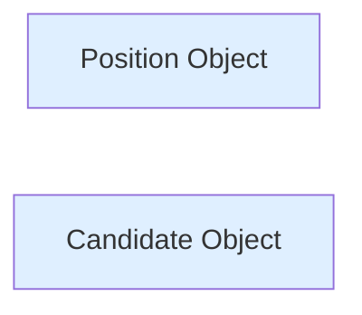
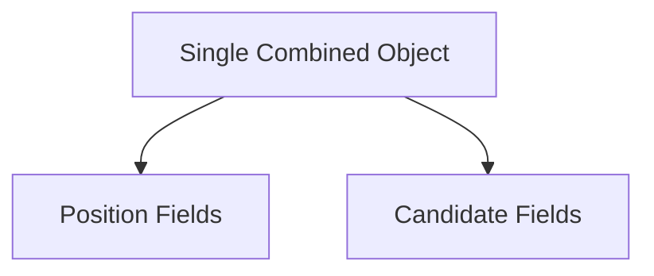
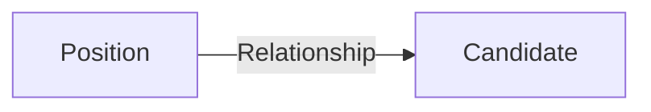
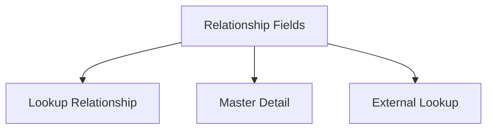
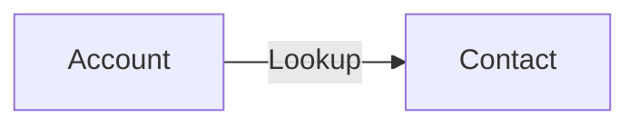
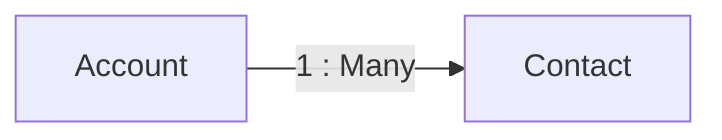
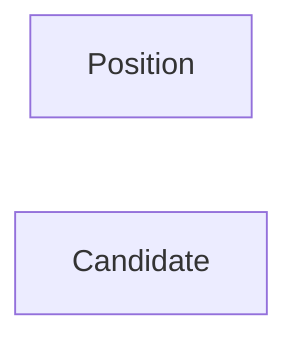
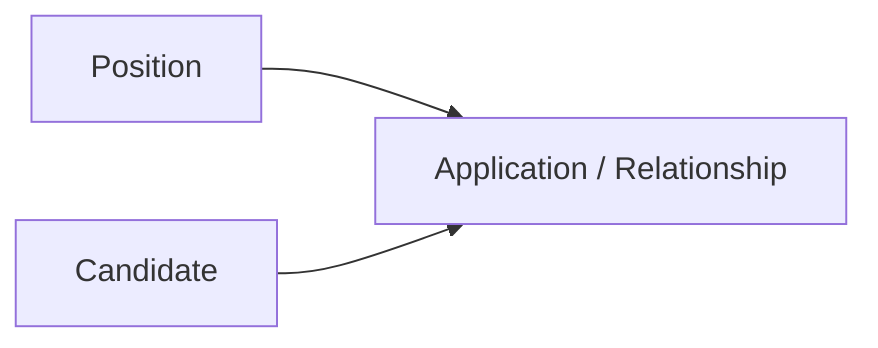

# Lesson 29 — Introduction to Object Relationships in Salesforce

## Lesson Summary

In this lesson, we introduce **Object Relationships** in Salesforce.

So far, we created two independent custom objects:
- **Position Object**
- **Candidate Object**

Both objects work individually, but there is currently **no connection between them**.

This lesson explains:
- Why relationships are required
- Problems with keeping objects independent
- Problems with combining everything into one object
- Introduction to Relationship Fields
- Relationship types available in Salesforce

---

## Key Points

- Objects should not remain isolated if data is related.
- Avoid duplicate data.
- Relationships allow objects to connect.
- Related records become visible automatically.
- Salesforce supports multiple relationship types.

---

## Current Application Architecture

Until now we created:



Problem:
❌ No relationship exists.

Cannot answer:
- Which candidates applied for which positions?
- How many candidates applied for a position?
- Which positions belong to a candidate?

---

## Business Requirement

Example:

Positions:
- Salesforce Developer
- Salesforce Admin

Candidates:
- John
- Jennifer
- Stacy

Application Data:

| Candidate | Applied Position |
| --- | --- |
| John | Salesforce Developer |
| John | Salesforce Admin |
| Jennifer | Salesforce Developer |
| Stacy | Salesforce Admin |

Current model cannot represent this relationship.

---

## Incorrect Solution — Single Large Object

One possible idea:

Combine Position + Candidate into one object.

Example:



Example Table:

| Position | Min Pay | Max Pay | Candidate |
| --- | --- | --- | --- |
| Salesforce Dev | 80k | 120k | John |
| Salesforce Dev | 80k | 120k | Jennifer |
| Salesforce Dev | 80k | 120k | Stacy |

---

## Problems With This Approach

### 1. Data Duplication

Position data repeats.

Example:
```
Salesforce Developer
Salesforce Developer
Salesforce Developer
```

Stored multiple times.

---

### 2. Difficult Maintenance

Updating one position requires updating multiple records.

---

### 3. No Reusability

Position data cannot be reused elsewhere.

Example:

Future objects:
- Job Portal
- Reviews
- Applications

---

## Correct Solution — Relationships

Salesforce solves this using **Relationship Fields**.

Instead of merging objects:

Create a connection.

Updated Architecture:



Result:
- Position remains independent
- Candidate remains independent
- Data stays reusable

---

## What Is an Object Relationship?

Relationship:

A connection between two objects.

Created by:
```
Relationship Field
```

Relationship fields allow:
- View related records
- Navigate between objects
- Share data

---

## Navigation — Create Relationship Field

```
Setup → Object Manager → Select Object → Fields & Relationships → New
```

---

## Relationship Field Types

When creating a new field:

```
Fields & Relationships → New
```

Available relationship options:

| Relationship Type | Purpose |
| --- | --- |
| Lookup Relationship | Loose relationship |
| Master-Detail Relationship | Strong dependency |
| External Lookup Relationship | Connect external objects |

---

## Relationship Overview



---

## Real Salesforce Example — Account & Contact

Standard Salesforce already uses relationships.

Example:



Meaning:

One Account can have multiple Contacts.

Example:

| Account | Contact |
| --- | --- |
| Google | John |
| Google | Smith |
| Microsoft | Jennifer |

---

## Navigation — View Relationships Using Schema Builder

```
Setup → Schema Builder
```

Steps:
1. Open Schema Builder
2. Select Account
3. Select Contact
4. Observe connecting line

Result:

Relationship becomes visible.

---

## Relationship Visualization



Meaning:

One Account → Multiple Contacts

---

## Current Recruiting Application

Current State:



No relationship.

Future State:



This allows:
- One Candidate → Multiple Positions
- One Position → Multiple Candidates

---

## Important Terms

| Term | Meaning |
| --- | --- |
| Relationship | Connection between objects |
| Lookup | Flexible object connection |
| Master Detail | Parent-child dependency |
| Schema Builder | Visual object model |
| Related Record | Connected object data |

---

## Certification Focus

> [!IMPORTANT]
> **Object ≠ Isolated Data**
>
> Use Relationships when:
> - Data repeats
> - Objects interact
> - Reporting needs connected data

Common mistakes:
❌ Creating one giant object
❌ Duplicating fields
❌ Ignoring relationships

---

## Quick Revision (30 sec)

- Position and Candidate are independent.
- Single-table approach causes duplication.
- Relationships solve the problem.
- Relationship created using fields.
- Relationship types introduced.
- Schema Builder shows object links.
- Next lesson → Create first relationship.