# Lesson 30 — Relationship Types in Salesforce (One-to-Many Relationship & Lookup Introduction)

## Lesson Summary

In this lesson, we start learning **Relationship Types in Salesforce**.

Previously, we identified that our Recruiting Application has two independent objects:
- Position
- Candidate

To connect related data, Salesforce provides **Object Relationships**.

This lesson focuses on:
- One-to-Many Relationship
- Parent and Child Objects
- Where Relationship Fields are created
- Introduction to Lookup Relationship
- Real-world relationship examples

---

## Key Points

- Relationships connect objects.
- One-to-Many is the most common relationship type.
- Parent = One side.
- Child = Many side.
- Relationship field is always created on the child object.
- Lookup Relationship is loosely coupled.

---

## Relationship Types Overview

Salesforce supports multiple relationship models.

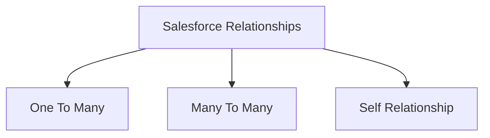

This lesson starts with:
`One → Many Relationship`

---

## What Is One-to-Many Relationship?

One record can be associated with multiple records.

General form:
```
One Parent
↓
Multiple Child Records
```

---

## One-to-Many Architecture

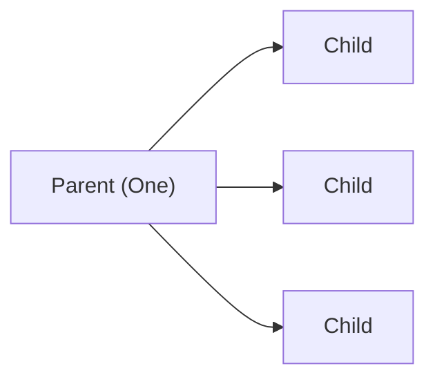

---

## Example 1 — Hiring Manager & Positions

Business Scenario:

A company has hiring managers.
One manager can manage multiple positions.
But one position can only have one manager.

Relationship:

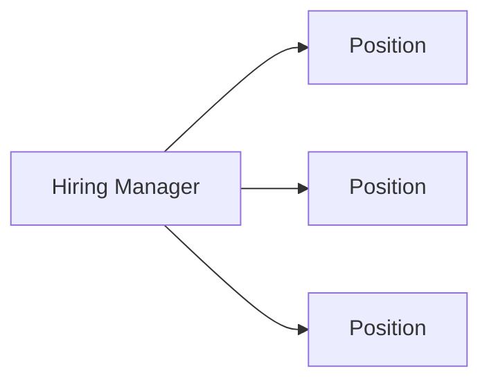

### Parent vs Child

| Object | Type |
| --- | --- |
| Hiring Manager | Parent |
| Position | Child |

Relationship Field goes on:
`Position Object`

---

## Example 2 — Doctor & Patient

One doctor treats multiple patients.
One patient belongs to one doctor.

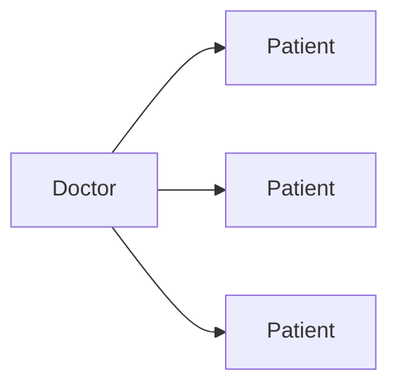

| Object | Role |
| --- | --- |
| Doctor | Parent |
| Patient | Child |

---

## Example 3 — Teacher & Students

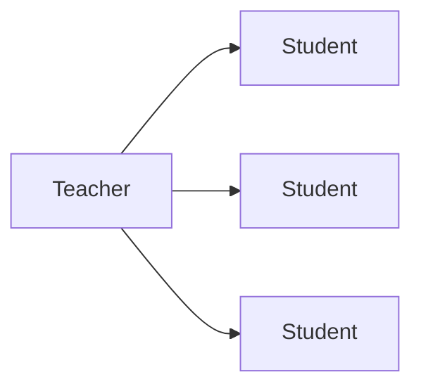

One teacher teaches many students.

---

## Example 4 — School & Students

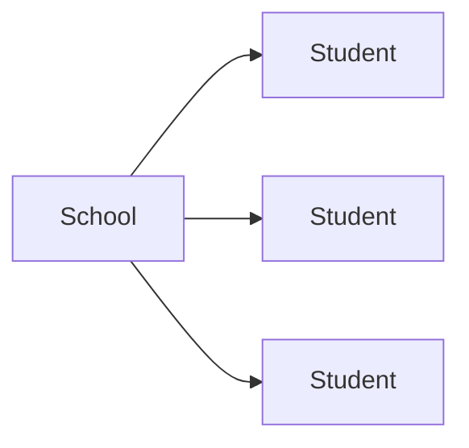

| Object | Type |
| --- | --- |
| School | Parent |
| Student | Child |

---

## Recruiting Application Example

Business Requirement:

One Position receives multiple Job Applications.

Example:

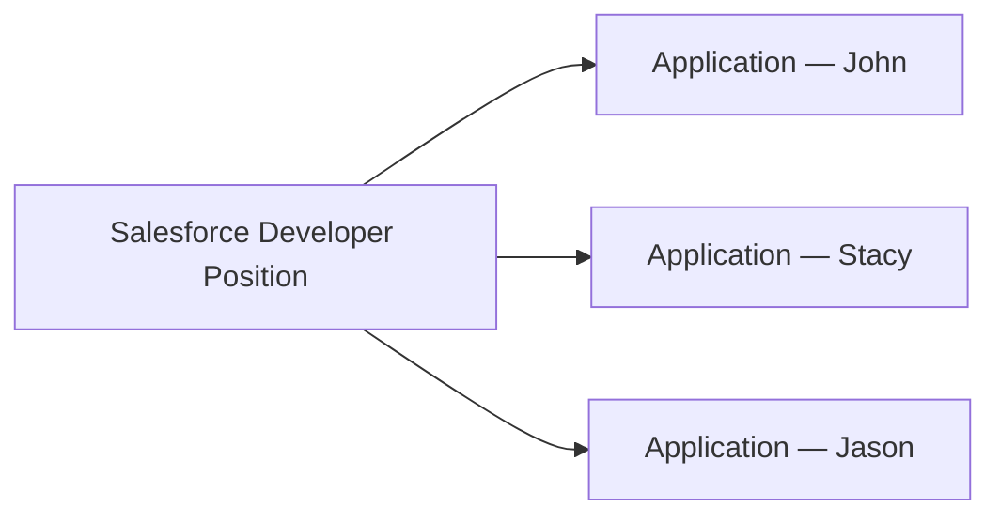

Meaning:
- One Position → Many Applications
- One Application → One Position

---

## Most Important Rule

> [!IMPORTANT]
> **Relationship Field ALWAYS goes on Child Object.**

Rule:
`Relationship Field → Child Object`

Because:
Child stores the reference to Parent.

Examples:

| Parent | Child | Relationship Field Goes On |
| --- | --- | --- |
| School | Student | Student |
| Doctor | Patient | Patient |
| Manager | Position | Position |
| Position | Job Application | Job Application |

---

## Relationship Creation Navigation

*(Note: As covered in Lesson 29, the navigation to create a relationship is as follows)*

```
Gear Icon → Setup → Object Manager → Select Object → Fields & Relationships → New
```

---

## One-to-Many Relationship Types

One-to-many relationships are implemented using:

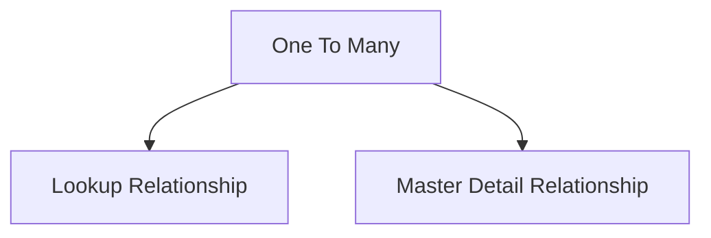

---

## Lookup Relationship (Introduction)

Lookup Relationship is:
`Loosely Coupled Relationship`

Meaning:
Parent and Child are independent.

Characteristics:
- Parent can exist independently
- Child can exist independently
- Child survives parent deletion
- Separate sharing settings

---

## Lookup Relationship Architecture

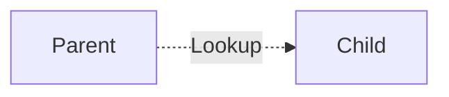

---

## Example — Meetup & Participants

Business Scenario:

One meetup event.
Multiple participants.

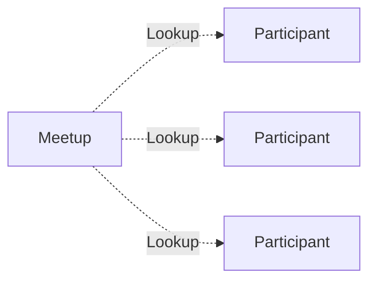

If Meetup gets deleted:
✅ Participants remain.

---

## Lookup Relationship Characteristics

| Feature | Lookup |
| --- | --- |
| Relationship Type | Loose |
| Parent Required | No |
| Child Independent | Yes |
| Parent Delete Removes Child | No |
| Separate Security | Yes |

---

## Recruiting Application — Next Implementation

Next lesson objective:

Create:
`Hiring Manager Field`

Relationship:

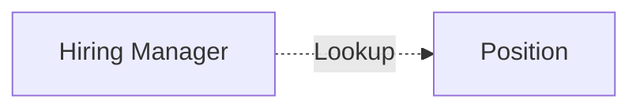

We will create:
- Lookup Relationship
- Parent → User
- Child → Position

---

## Important Terms

| Term | Meaning |
| --- | --- |
| Parent Object | One side |
| Child Object | Many side |
| Lookup Relationship | Loose relationship |
| Relationship Field | Field connecting objects |
| One-to-Many | One record → Multiple records |

---

## Certification Focus

> [!IMPORTANT]
> **Relationship Field ALWAYS → Child Object**

Lookup Relationship:
- Child survives deletion
- Independent objects
- Separate sharing settings

Common mistakes:
❌ Creating relationship on parent
❌ Confusing parent and child
❌ Assuming child deletes automatically

---

## Quick Revision (30 sec)

- Started relationship types.
- Learned One-to-Many relationship.
- Parent = One side.
- Child = Many side.
- Relationship field goes on child.
- Introduced Lookup Relationship.
- Parent and child stay independent.
- Next lesson → Create Hiring Manager lookup relationship.