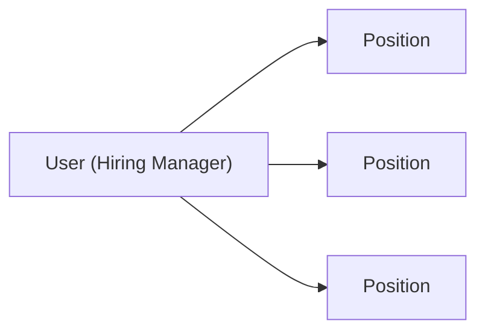
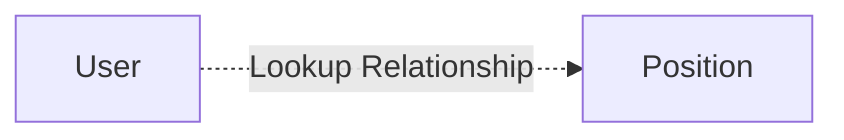
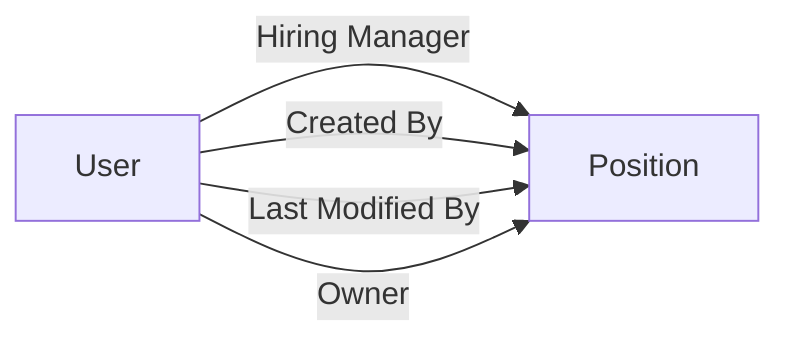

# Lesson 31 — Create First Lookup Relationship (Position → Hiring Manager)

## Lesson Summary

In this lesson, we create our **first Relationship Field** in Salesforce.

Previously, we learned:
- One-to-Many Relationship
- Parent vs Child Object
- Relationship field always goes on the Child Object
- Lookup Relationship (loosely coupled)

Now we implement this in our Recruiting Application.

We will create a **Lookup Relationship** between:
- **User (Hiring Manager)** → Parent
- **Position** → Child

This allows each Position to store information about its assigned Hiring Manager.

---

## Key Points

- Hiring Manager is stored in Salesforce **User Object**.
- One User can manage multiple Positions.
- One Position has one Hiring Manager.
- Relationship type = **Lookup Relationship**.
- Relationship field is created on **Position Object**.

---

## Business Requirement

Company Example:

| Hiring Manager | Position |
| --- | --- |
| Deepika | Salesforce Developer |
| Deepika | Salesforce Admin |
| Simran | Business Analyst |

Meaning:
One manager → Multiple positions.

This is:
`One → Many Relationship`

---

## Relationship Architecture



---

## Parent vs Child

| Object | Type |
| --- | --- |
| User | Parent |
| Position | Child |

Relationship Field Location:
`Position Object`

---

## Why User Object?

Salesforce already provides a standard object called:
`User`

User Object stores:
- Username
- Email
- Profile
- Role
- Login details

Whenever you create a Salesforce account:
A User record is automatically created.

---

## Navigation — View Existing Users

```
Gear Icon → Setup → Users → Users
```

Result:
You will see:
- System Administrator
- Integration User
- Additional created users

---

## Navigation — Create Lookup Relationship

```
Gear Icon → Setup → Object Manager → Position → Fields & Relationships → New
```

---

## Steps / Process — Create Lookup Relationship

### Step 1 — Create Relationship Field

Under **Fields & Relationships**

Click:
```
New
```

Choose:
```
Lookup Relationship
```

Description:
Creates a relationship that links this object to another object.

Click:
```
Next
```

---

### Step 2 — Select Related Object

Related Object:
```
User
```

Click:
```
Next
```

---

### Step 3 — Configure Field

Enter:

| Property | Value |
| --- | --- |
| Field Label | Hiring Manager |
| Child Relationship Name | Positions |

Click:
```
Next
```

---

### Step 4 — Configure Security

Select:
```
Visible for all profiles
```

Click:
```
Next
```

---

### Step 5 — Add To Layout

Enable:
```
Add Field To Page Layout
```

Click:
```
Save
```

---

## Result — New Field Created

Position Object now contains:
```
Hiring_Manager__c
```

Architecture becomes:



---

## Test Relationship

Open:
```
Recruiting App → Position → New
```

Enter:

| Field | Value |
| --- | --- |
| Position Title | Senior Manager |
| Location | Dallas |
| Hiring Manager | Deepika |

Click:
```
Save
```

Result:
Position record now stores selected User.

---

## Lookup UI Behavior

When opening Position:
Hiring Manager appears as:
`🔍 Lookup Icon`

Users can:
- Search users
- Select users
- Change users

Example:
`Hiring Manager → Simran`

---

## Create Additional Users (Optional Test)

Navigation:
```
Setup → Users → New User
```

Example:

| Property | Value |
| --- | --- |
| First Name | Simran |
| Last Name | Alok |
| License | Salesforce |
| Profile | System Administrator |

Save.
Now Position records show multiple users.

---

## Navigation — View Relationship Using Schema Builder

```
Setup → Schema Builder
```

Steps:
1. Clear existing schema
2. Select Position
3. Select User

Result:
Relationship lines appear.

---

## Schema Builder View



Notice:
Multiple relationship lines appear because Salesforce already creates standard lookup relationships.

---

## Relationship Explanation

Position contains:
```
Hiring_Manager__c
```

This field stores:
```
User Record ID
```

Example:
`005xxxxxxxxxxxx`

Salesforce automatically displays:
`Deepika Khanna`
instead of showing the ID.

---

## Lookup Relationship Characteristics

| Feature | Lookup |
| --- | --- |
| Parent Required | No |
| Child Independent | Yes |
| Parent Delete Removes Child | No |
| Separate Security | Yes |

Example:
Delete User →
✅ Position still exists.

---

## Important Terms

| Term | Meaning |
| --- | --- |
| User Object | Standard Salesforce object storing users |
| Lookup Relationship | Loose object relationship |
| Parent Object | One side |
| Child Object | Many side |
| Relationship Field | Field connecting objects |

---

## Certification Focus

> [!IMPORTANT]
> **Relationship Field ALWAYS → Child Object**

For One-to-Many:
```
Parent = One
Child = Many
```

Lookup:
```
Delete Parent ≠ Delete Child
```

Common mistakes:
❌ Creating relationship on User
❌ Choosing Master Detail accidentally
❌ Forgetting child object rule

---

## Quick Revision (30 sec)

- Created first Lookup Relationship.
- Connected Position → User.
- User became Parent.
- Position became Child.
- Added Hiring Manager field.
- Tested lookup selection.
- Viewed relationship in Schema Builder.
- Prepared for next relationship lessons.