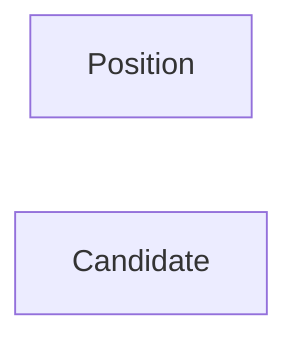
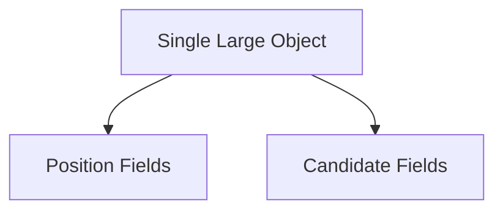
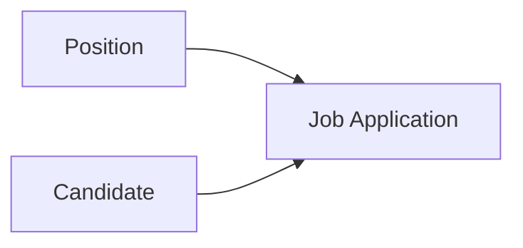
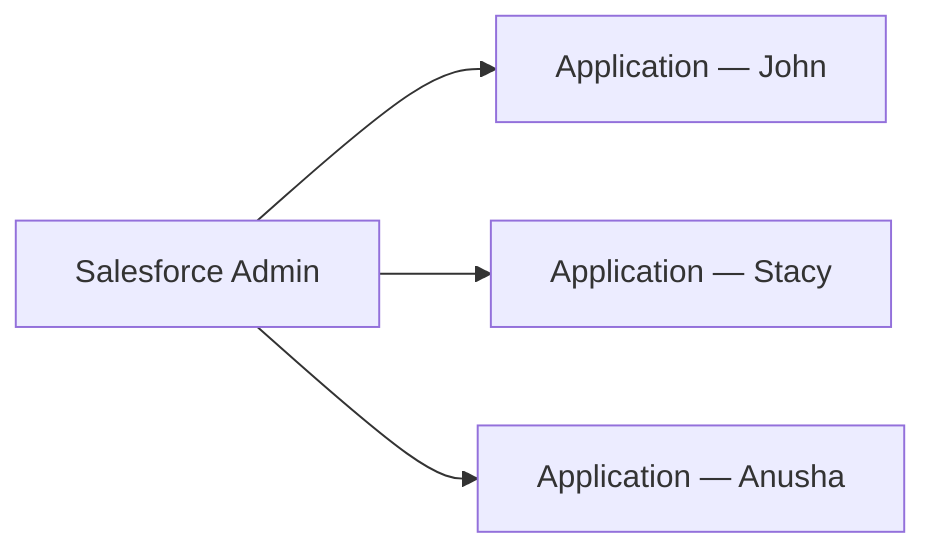
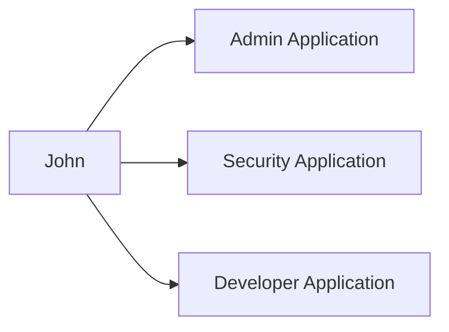
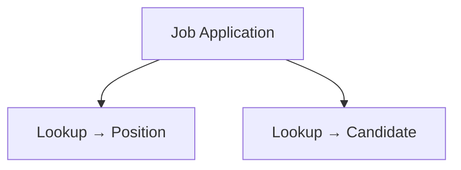

# Lesson 32 — Designing Relationships Using Job Application Object

## Lesson Summary

In this lesson, we return to the original problem:

> How do we connect **Position** and **Candidate**?

Previously, we created:
- Position Object
- Candidate Object

But both objects remain independent.

To solve this, we introduce a third object:
`Job Application`

The Job Application object acts as an intermediate object that connects:
- Candidate
- Position

This design allows us to:
- Track which candidate applied to which position
- Track how many candidates applied for a position
- Track how many positions a candidate applied for

---

## Key Points

- Position and Candidate remain independent.
- Introduce Job Application as a bridge object.
- Create relationships instead of merging tables.
- Relationship fields always go on the child object.
- Job Application becomes the connecting layer.

---

## Problem Statement

Current Architecture:



Problem:
Cannot answer:
- Which candidate applied for which position?
- How many applications exist?
- Which positions belong to one candidate?

---

## Incorrect Approach — Combine Everything Into One Object

Possible approach:



Problems:
❌ Duplicate records
❌ Difficult maintenance
❌ Poor scalability
❌ No reusability

---

## Correct Solution — Introduce Job Application

New Architecture:



Job Application becomes the connector.

---

## Business Scenario

Example Positions:
- Salesforce Admin
- Salesforce Developer
- Security Engineer

Candidates:
- John
- Stacy
- Anusha

Applications:

| Candidate | Position |
| --- | --- |
| John | Salesforce Admin |
| John | Security Engineer |
| Stacy | Salesforce Admin |
| Anusha | Salesforce Developer |

Job Application stores this connection.

---

## Relationship 1 — Position → Job Application

Business Rule:

One Position receives multiple applications.

Example:



### Relationship Analysis

| Object | Type |
| --- | --- |
| Position | Parent |
| Job Application | Child |

Relationship Type:
`One → Many`

Relationship Field Location:
`Job Application Object`

---

## Relationship 2 — Candidate → Job Application

Business Rule:

One Candidate can apply to multiple positions.

Example:



### Relationship Analysis

| Object | Type |
| --- | --- |
| Candidate | Parent |
| Job Application | Child |

Relationship Type:
`One → Many`

Relationship Field Location:
`Job Application Object`

---

## Final Relationship Model

When both relationships exist:


Job Application acts as:
`Bridge Object`

---

## Why Job Application Is Needed

Without Job Application:
`Candidate ↔ Position`
Cannot scale.

With Job Application:
```
Candidate
↓
Job Application
↓
Position
```

Now Salesforce can answer:
- Candidate applied to which positions?
- Position received how many applications?
- Application status tracking.

---

## Future Expansion Possibilities

Job Application can later store:

| Field |
| --- |
| Application Date |
| Application Status |
| Interview Result |
| Offer Status |
| Approval Status |
| Recruiter Notes |

This would not fit properly inside Position or Candidate.

---

## Navigation — Create Job Application Object (Next Lesson)

```
Gear Icon → Setup → Object Manager → Create → Custom Object
```

Object Details:

| Property | Value |
| --- | --- |
| Label | Job Application |
| Plural Label | Job Applications |

---

## Relationship Planning

After creating Job Application:

We will create:

| Relationship | Type |
| --- | --- |
| Job Application → Position | Lookup |
| Job Application → Candidate | Lookup |

---

## Relationship Blueprint



---

## Important Terms

| Term | Meaning |
| --- | --- |
| Bridge Object | Intermediate object connecting records |
| Parent Object | One side |
| Child Object | Many side |
| Lookup Relationship | Loosely coupled relationship |
| Job Application | Connects candidate and position |

---

## Certification Focus

> [!IMPORTANT]
> **Relationship Field ALWAYS goes on Child Object**

In this lesson:
```
Position → Parent
Candidate → Parent
Job Application → Child
```

Common mistakes:
❌ Creating relationship on Position
❌ Creating relationship on Candidate
❌ Combining everything into one object

---

## Quick Revision (30 sec)

- Position and Candidate are independent.
- Introduced Job Application object.
- Position → Job Application = One-to-Many.
- Candidate → Job Application = One-to-Many.
- Relationship fields go on Job Application.
- Job Application becomes the connecting object.
- Next lesson → Create Job Application object.