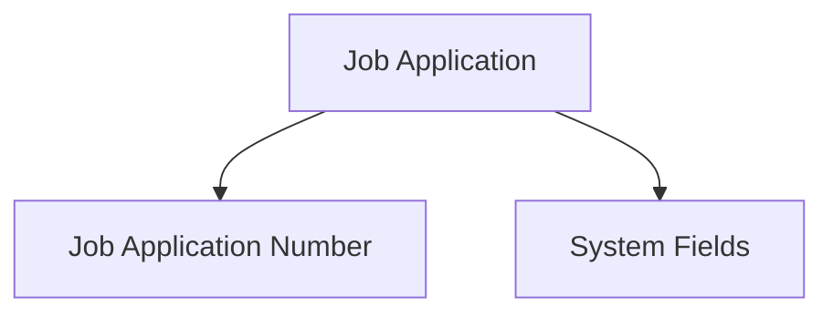
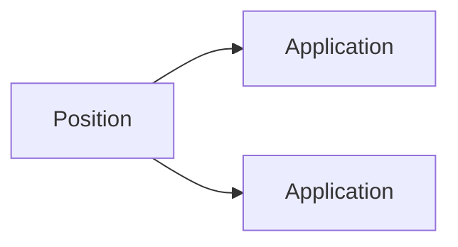
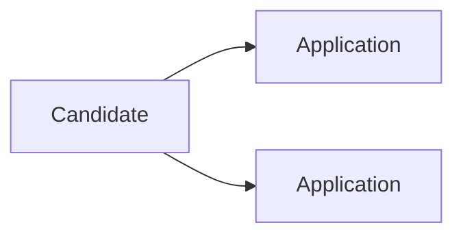
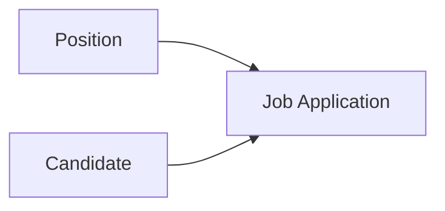
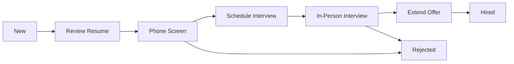

# Lesson 33 — Create Job Application Object & Build Relationships

## Lesson Summary

In this lesson, we create the **Job Application Object**, which acts as a **bridge object** between:
- Position Object
- Candidate Object

This completes the recruitment data model and allows Salesforce to answer:
- Which candidate applied for which position?
- How many candidates applied to a position?
- How many positions a candidate applied for?

We also create:
- Lookup Relationship → Position
- Lookup Relationship → Candidate
- Cover Letter field
- Application Status field

---

## Key Points

- Create a new custom object → Job Application.
- Use **Auto Number** as Record Name.
- Build **Lookup Relationship** to Position.
- Build **Lookup Relationship** to Candidate.
- Add Cover Letter field.
- Add Job Application Status picklist.
- View relationships using Schema Builder.

---

## Final Architecture


---

## Steps / Process — Create Job Application Object

### Step 1 — Create Job Application Object

Navigation:
```
Gear Icon → Setup → Object Manager → Create → Custom Object
```

Configure:

| Property | Value |
| --- | --- |
| Label | Job Application |
| Plural Label | Job Applications |
| Record Name | Job Application No |
| Data Type | Auto Number |
| Display Format | JA-{0000} |
| Starting Number | 1 |

Enable:
✔ Allow Reports
✔ Allow Activities
✔ Track Field History
✔ Allow Search

Enable:
✔ Launch New Custom Tab Wizard

Click:
```
Save
```

---

### Configure Tab

Choose:
```
Tab Style → Any Icon
```

Visibility:
```
Default On → All Profiles
```

Application:
```
Recruiting Application
```

Click:
```
Save
```

---

### Result

Recruiting App becomes:
```
Recruiting: Home, Position, Candidate, Job Application, Reports, Dashboards
```

---

### Object Structure

After creation:



System Fields:
- Created By
- Owner
- Last Modified By
- Created Date

---

## Steps / Process — Create Position Relationship

### Step 2 — Create Position Relationship

Business Rule:

One Position → Many Applications

Relationship:



---

### Navigation

```
Setup → Object Manager → Job Application → Fields & Relationships → New
```

Choose:
```
Lookup Relationship
```

Related Object:
```
Position
```

Configure:

| Property | Value |
| --- | --- |
| Field Label | Position |
| Child Relationship Name | Job_Applications |

Save.

---

### Result

Field Created:
```
Position__c
```

---

## Steps / Process — Create Candidate Relationship

### Step 3 — Create Candidate Relationship

Business Rule:

One Candidate → Many Applications

Relationship:



---

### Navigation

```
Setup → Object Manager → Job Application → Fields & Relationships → New
```

Choose:
```
Lookup Relationship
```

Related Object:
```
Candidate
```

Configure:

| Property | Value |
| --- | --- |
| Field Label | Candidate |
| Child Relationship Name | Job_Applications |

Save.

---

### Result

Field Created:
```
Candidate__c
```

---

## Relationship View

Open:
```
Setup → Schema Builder
```

Select:
- Position
- Candidate
- Job Application

Expected:



Relationship Type:
```
Lookup Relationship
```

---

## Steps / Process — Create Fields

### Step 4 — Create Cover Letter Field

Purpose:
Store candidate cover letter.

Navigation:
```
Job Application → Fields & Relationships → New
```

Choose:
```
Text Area (Long)
```

Configure:

| Property | Value |
| --- | --- |
| Field Label | Cover Letter |
| Visible Lines | 4 |

Save.

---

### Result

Field:
```
Cover_Letter__c
```

---

### Step 5 — Create Application Status

Purpose:
Track hiring stages.

Navigation:
```
Fields & Relationships → New
```

Choose:
```
Picklist
```

Field:
```
Status
```

Values:
```
New
Review Resume
Phone Screen
Schedule Interview
In-Person Interview
Extend Offer
Hired
Rejected
```

Save.

---

## Job Application Lifecycle



---

## Example Record

Create:

```
Position: Director of Marketing
Candidate: Candidate-003
Cover Letter: Attached
Status: New
```

Save.

---

## Verify Relationships

Open:
```
Recruiting → Position → Director of Marketing → Related
```

Expected:
```
Job Applications (2)
```

Meaning:
Two candidates applied.

---

Open:
```
Recruiting → Candidate → Related
```

Expected:
```
Job Applications
```

Meaning:
Candidate applied for multiple positions.

---

## Important Concepts

| Term | Meaning |
| --- | --- |
| Lookup Relationship | Loose coupling |
| Parent Object | One side |
| Child Object | Many side |
| Bridge Object | Connects objects |
| Job Application | Tracks applications |

---

## Certification Focus

> [!IMPORTANT]
> **Relationship Field ALWAYS goes on Child Object**

In this lesson:
```
Position → Parent
Candidate → Parent
Job Application → Child
```

Common mistakes:
❌ Creating relationship on Position
❌ Creating relationship on Candidate
❌ Forgetting Custom Tab
❌ Using Master-Detail instead of Lookup

---

## Quick Revision (30 sec)

- Created Job Application object.
- Used Auto Number record naming.
- Created Position lookup.
- Created Candidate lookup.
- Added Cover Letter.
- Added Status picklist.
- Connected Position and Candidate.
- Completed Recruiting Application relationship model.