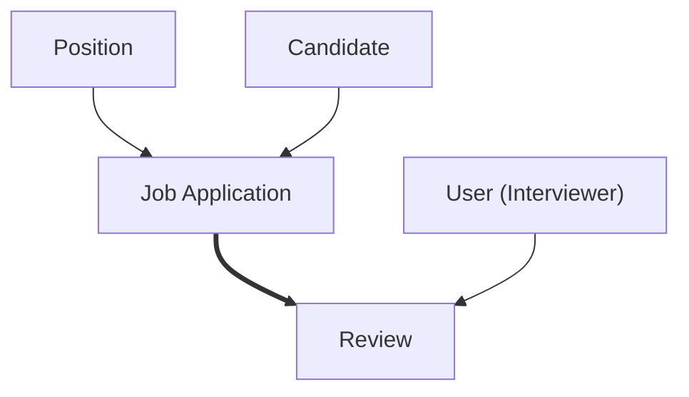
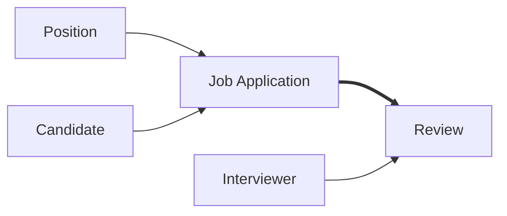

# Lesson 35 — Create Review Object and Establish Master-Detail Relationship

## Lesson Summary

In this lesson, we continue building the **Recruiting Application** by creating the fourth custom object — **Review**.

So far, we have created:
1. **Position** → Stores open job positions
2. **Candidate** → Stores candidate information
3. **Job Application** → Connects Candidate and Position

Now we introduce:
1. **Review** → Stores interviewer feedback and ratings for a job application

This lesson introduces the first practical implementation of a **Master-Detail Relationship**.

---

## Business Scenario

Once a candidate applies for a position:

```
Candidate
↓
Job Application Created
↓
Interview Process
↓
Multiple Interviewers Submit Reviews
```

Each interviewer evaluates:
- Technical skills
- Communication
- Experience
- Overall recommendation

These evaluations are stored inside the **Review Object**.

---

## Why Create a Review Object?

A review has **no business meaning by itself**.

Example:

```
Review:
Rating = 8
Feedback = Excellent Communication
```

Without knowing:
`Which Job Application?`

the review becomes useless.

Because of this dependency:

```
Job Application
↓
Review
```

must use:
`Master-Detail Relationship`

---

## Relationship Design

### Job Application → Review

Relationship:

```
One Job Application
↓
Many Reviews
```

Example:

```
Salesforce Developer Position
↓
Application #1
↓
Review 1 → HR
Review 2 → Technical Lead
Review 3 → Senior Manager
```

---

### Relationship Architecture



Legend:
```
→ Lookup Relationship
==> Master-Detail Relationship
```

---

## Steps / Process — Create Review Object

### Navigation — Create Review Object

```
Gear Icon → Setup → Object Manager → Create → Custom Object
```

---

### Step 1 — Create Review Object

Configure:

| Property | Value |
| --- | --- |
| Label | Review |
| Plural Label | Reviews |
| Record Name | Review No |
| Data Type | Auto Number |
| Display Format | RV-{0000} |
| Starting Number | 1 |
| Allow Reports | Enabled |
| Allow Activities | Enabled |
| Track Field History | Enabled |
| Create Custom Tab | No |

Click:
```
Save
```

---

### Review Object Created

Object:
`Review__c`

Record Name:
`Review Number`

Example:
```
RV-001
RV-002
RV-003
```

---

## Steps / Process — Create Review Fields

### Step 2 — Create Rating Field

Navigation:
```
Object Manager → Review → Fields & Relationships → New
```

Configure:

| Property | Value |
| --- | --- |
| Label | Rating |
| Data Type | Number |
| Length | 2 |
| Decimal | 0 |

Save.

Purpose:
Store interviewer score.

Example:
`8 / 10`

---

### Step 3 — Create Feedback Field

Create another field.

Configure:

| Property | Value |
| --- | --- |
| Data Type | Text Area (Long) |
| Label | Feedback |

Save.

Purpose:
Store reviewer comments.

Example:
```
Strong technical knowledge.
Good communication.
Recommended.
```

---

## Steps / Process — Create Relationships

### Step 4 — Create Master-Detail Relationship

Navigation:
```
Review → Fields & Relationships → New → Master-Detail Relationship
```

Select:
```
Related To:
Job Application
```

Configure:

| Property | Value |
| --- | --- |
| Relationship | Job Application |
| Child Object | Review |
| Parent Object | Job Application |

Save.

---

### Why Master-Detail?

Because:
```
Delete Job Application
↓
Delete Reviews Automatically
```

Review cannot exist independently.

---

### Step 5 — Create Interviewer Relationship

Now identify:
`Who submitted the review?`

Create:
`Lookup Relationship`

Navigation:
```
Review → Fields & Relationships → New → Lookup Relationship
```

Related Object:
`User`

Configure:

| Property | Value |
| --- | --- |
| Label | Interviewer Name |
| Related To | User |
|Child Relationship name|Reviews|

Save.

---

## Final Review Object Fields

| Field | Type |
| --- | --- |
| Review Number | Auto Number |
| Job Application | Master-Detail |
| Interviewer Name | Lookup(User) |
| Rating | Number(2) |
| Feedback | Text Area(Long) |

---

## Final Data Model



---

## Relationship Explanation

### Position → Job Application

Type:
`Lookup`

One position can receive many applications.

---

### Candidate → Job Application

Type:
`Lookup`

One candidate may apply to multiple positions.

---

### Job Application → Review

Type:
`Master Detail`

One application receives many reviews.

---

### User → Review

Type:
`Lookup`

One interviewer reviews many candidates.

---

## Schema Builder Verification

Navigation:
```
Setup → Schema Builder
```

Select:
- Position
- Candidate
- Job Application
- Review

Expected structure:
```
Position
↓
Job Application
↓
Review

Candidate
↓
Job Application

User
↓
Review
```

---

## Important Terms

| Term | Meaning |
| --- | --- |
| Review Object | Stores interviewer evaluations |
| Master-Detail | Strong relationship |
| Lookup | Loose relationship |
| Interviewer | User submitting review |
| Rating | Numeric evaluation |

---

## Certification Focus

> [!IMPORTANT]
> **Important for Exam**
>
> Remember:
> `Relationship field → Always created on Child`
>
> Master-Detail:
> ```
> Parent Deleted
> ↓
> Child Deleted
> ```
> 
> Lookup:
> ```
> Parent Deleted
> ↓
> Child Survives
> ```

### Common Mistakes

❌ Creating Review as standalone object
❌ Using Lookup instead of Master-Detail
❌ Putting relationship on parent
❌ Forgetting interviewer lookup

---

## Quick Revision (30 sec)

- Created Review object
- Record Name → Auto Number
- Added Rating field
- Added Feedback field
- Created Master-Detail → Job Application
- Created Lookup → User
- Connected recruiting application flow
- Verified relationships in Schema Builder