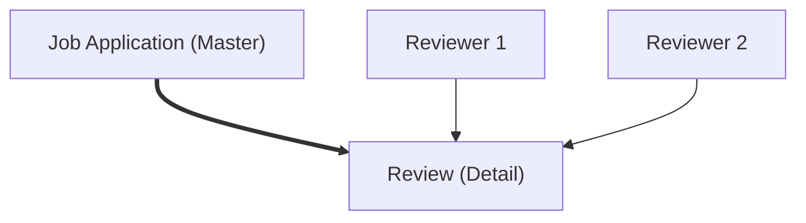
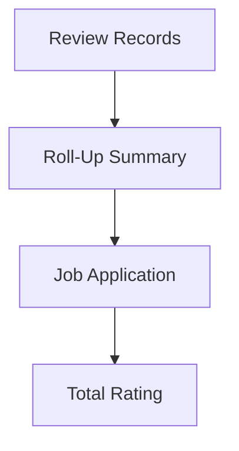

# Lesson 36 — Introduction to Roll-Up Summary Fields (Review → Job Application)

## Lesson Summary

In this lesson, we introduce **Roll-Up Summary Fields** in Salesforce.

In the previous lesson, we created:
- **Review Object**
- **Master-Detail Relationship**
    - Parent → Job Application
    - Child → Review

Now we will understand how Salesforce can automatically calculate values from child records and display the result on the parent record.

This is done using:
`Roll-Up Summary Field`

---

## Business Scenario

So far our Recruiting Application flow looks like:

```
Candidate
↓
Job Application
↓
Reviews Submitted
↓
Final Hiring Decision
```

Each Job Application can receive multiple reviews.

Example:

| Reviewer | Rating |
| --- | --- |
| Deepika | 8 |
| Simran | 7 |

Business wants:
`Total Rating = 15`

Instead of calculating manually, Salesforce can automatically calculate and display the result.

---

## What is a Roll-Up Summary Field?

A **Roll-Up Summary Field** summarizes values from related child records and displays the result on the parent record.

Roll-Up Summary works only when:

```
Master Object
↓
Master-Detail Relationship
↓
Detail Records
```

Salesforce automatically updates values whenever child records change.

---

## Current Data Model



Meaning:
```
One Job Application
↓
Multiple Reviews
```

---

## Example Review Calculation

### Job Application — JA001

| Reviewer | Rating |
| --- | --- |
| Deepika | 8 |
| Simran | 7 |

Result:
`Total Rating = 15`

---

### Job Application — JA002

| Reviewer | Rating |
| --- | --- |
| Reviewer 1 | 8 |
| Reviewer 2 | 9 |
| Reviewer 3 | 10 |

Result:
`Total Rating = 27`

---

## What Roll-Up Summary Can Calculate

Roll-Up Summary supports four operations.

| Operation | Description |
| --- | --- |
| COUNT | Count child records |
| SUM | Add numeric values |
| MIN | Smallest value |
| MAX | Largest value |

---

## Roll-Up Summary Examples

### Example 1 — COUNT

Count reviews.
`JA001 ↓ Reviews = 2`

---

### Example 2 — SUM

Add ratings.
`8 + 7 = 15`

---

### Example 3 — MAX

Find highest score.
```
Ratings:
7
8
9
MAX = 9
```

---

### Example 4 — MIN

Find lowest score.
```
Ratings:
7
8
9
MIN = 7
```

---

## Roll-Up Summary Architecture



---

## Important Rule

Roll-Up Summary is available only:
`Master Object + Master-Detail Relationship`

NOT available for:
`Lookup Relationship`

Example:

| Relationship | Roll-Up Available |
| --- | --- |
| Lookup | ❌ No |
| Master Detail | ✅ Yes |

---

## Why Lookup Does Not Support Roll-Up

Lookup relationships are loosely connected.

Example:

```
Parent Deleted
↓
Child survives
```

Because records are independent, Salesforce does not automatically summarize child values.

---

## Important Limitation

After creating a Roll-Up Summary:
`Master Detail`
cannot be converted into:
`Lookup Relationship`

Reason:
Salesforce would lose summary calculations.

---

## Example Recruiting Scenario

### Job Application

`JA-001`

Related Reviews:

| Review | Rating |
| --- | --- |
| Review 1 | 8 |
| Review 2 | 7 |
| Review 3 | 9 |

Roll-Up Summary calculates:
`24`
Automatically.

---

## Navigation (Next Lesson)

In the next lesson we will actually create:
`Total Rating`
field.

Navigation:
```
Setup → Object Manager → Job Application → Fields & Relationships → New → Roll-Up Summary
```

---

## Important Terms

| Term | Meaning |
| --- | --- |
| Roll-Up Summary | Aggregates child values |
| Master Object | Parent object |
| Detail Object | Child object |
| SUM | Adds values |
| COUNT | Counts records |
| MAX | Highest value |
| MIN | Lowest value |

---

## Certification Focus

> [!IMPORTANT]
> **Important for Exam**
>
> Remember:
> `Roll-Up Summary = Master Object Only`
> `Master Detail Required`
> 
> Functions supported:
> `COUNT`
> `SUM`
> `MIN`
> `MAX`

### Common Mistakes
❌ Creating Roll-Up on child object
❌ Using Lookup relationship
❌ Expecting manual updates
❌ Forgetting Master-Detail requirement

---

## Real-World Application

Roll-Up Summary is commonly used to:
- Calculate total order value
- Count interview reviews
- Calculate employee PTO
- Count open positions
- Calculate candidate ratings

---

## Quick Revision (30 sec)

- Introduced Roll-Up Summary Field
- Works only in Master-Detail
- Summarizes child records
- Supports COUNT, SUM, MIN, MAX
- Displays result on parent
- Job Application → Review example
- Prepared for creating Total Rating field in next lesson