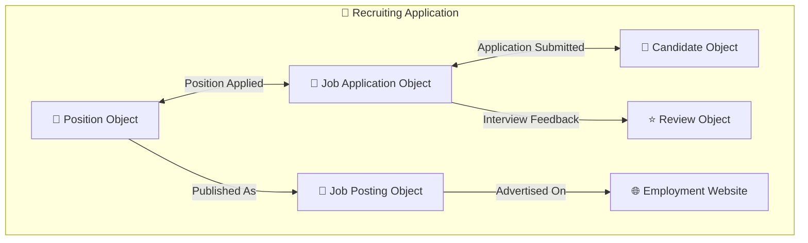
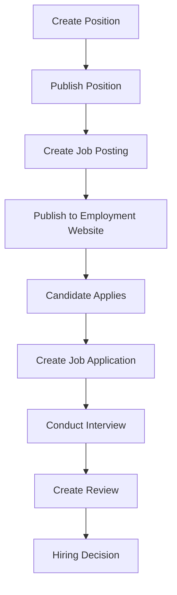

# Lesson 9 — Recruiting Application Overview (Platform App Builder Project)

## Lesson Summary

This lesson introduces the **Recruiting Application**, which will serve as the **main project throughout the course**. Instead of learning Salesforce concepts independently, the course uses a real business scenario to teach concepts required for the **Salesforce Platform App Builder Certification**.

Through this application, we will gradually build a complete recruitment system while learning **Custom Objects, Data Modeling, Data Import, Validation Rules, Approval Processes, and Workflow Automation**.

---

## Key Points

- Recruiting Application is the **core project of the course**
- Designed to prepare for **Salesforce Platform App Builder Certification**
- Multiple **Custom Objects** will be created
- Covers complete business process implementation
- Topics included:
    - **Custom Objects**
    - **Data Modeling**
    - **Data Import**
    - **Validation Rules**
    - **Approval Processes**
    - **Workflow Automation**
    - **Salesforce Fundamentals**

---

## Detailed Notes

### Purpose of the Recruiting Application

The Recruiting Application simulates a real company recruitment system.

**Goal:**
- Learn Salesforce through implementation
- Build practical business applications
- Cover certification concepts using one project

**Business Requirement:**
A company wants to:
- Manage job openings
- Track applicants
- Conduct interviews
- Store reviews
- Publish jobs externally

Salesforce will be used to manage the complete hiring lifecycle.

---

## Recruiting Application Architecture

The application will be built using multiple custom objects that work together.



### Diagram Explanation

| Object | Purpose |
| --- | --- |
| **Position** | Stores open positions in company |
| **Job Application** | Connects candidates to positions |
| **Candidate** | Stores applicant details |
| **Review** | Stores interview evaluation |
| **Job Posting** | Tracks published openings |
| **Employment Website** | External job portals |

### Business Process Flow



---

### Custom Object 1 — Position

**Purpose:**
Store available openings inside the company.

**Examples:**
- Salesforce Administrator
- Salesforce Developer
- Business Analyst

**Example Data:**

| Position | Status |
| --- | --- |
| Salesforce Admin | Open |
| Salesforce Developer | Open |

**Stores:**
- Position Name
- Job Availability
- Status

---

### Custom Object 2 — Candidate

**Purpose:**
Store candidate information.

**Captured details:**
- First Name
- Last Name
- Address
- Phone Number
- Skills

**Example:**

| Candidate | Skills |
| --- | --- |
| John | Salesforce |
| Steve | Apex |

---

### Custom Object 3 — Job Application

**Purpose:**
Acts as a bridge between **Position** and **Candidate**.

**Business Logic:**
- One candidate can apply for multiple positions
- One position can receive multiple applications

**Example:**

| Candidate | Position |
| --- | --- |
| John | Salesforce Admin |

---

### Custom Object 4 — Review

**Purpose:**
Store interviewer evaluation.

**Process:**
1. Candidate applies
2. Interview conducted
3. Feedback submitted
4. Review stored

**Possible data:**
- Rating
- Recommendation
- Comments

---

### Custom Object 5 — Job Posting

**Purpose:**
Track jobs published externally.

**Examples:**
- LinkedIn
- Monster
- Indeed

**Example:**

| Position | Portal |
| --- | --- |
| Salesforce Admin | LinkedIn |

---

### Employment Website

**Purpose:**
Represents external recruitment portals where positions are advertised.

**Example flow:**
```
Position ──► Job Posting ──► Employment Website
```

---

## Topics Covered Through This Application

This project will be used to learn:

### Salesforce Fundamentals
Core platform concepts.

### Custom Objects
Business-specific data storage.

### Data Modeling
Designing object relationships.

### Data Import
Loading records.

### Validation Rules
Data quality enforcement.

### Approval Processes
Controlled approvals.

### Workflow Automation
Automating business actions.

---

## Steps / Process

### Recruiting Workflow

1. Create Position
2. Publish Job
3. Candidate Applies
4. Create Application
5. Conduct Review
6. Final Decision

---

## Navigation — Create Recruiting Application

```
Gear Icon → Setup → Quick Find → App Manager → New Lightning App
```

*Source: Lecture walkthrough*

---

## Steps / Process — Build Recruiting Application

### Step 1 — Open App Manager

1. Navigate to `Setup → App Manager`
2. Click **New Lightning App**

---

### Step 2 — Configure Application

Configure the basic properties:

| Setting | Value |
| --- | --- |
| **App Name** | Recruiting |
| **Description** | Recruiting Application to keep track of open Job positions in your company |
| **Color** | *Optional* |
| **Logo** | *Optional* |

Click **Next**.

---

### Step 3 — Select Navigation

1. Choose **Standard Navigation**
2. Click **Next**

---

### Step 4 — Select Devices

1. Choose **Desktop + Phone** (or Desktop only depending on preference)
2. Click **Next**

---

### Step 5 — Configure Utility Items

*Optional:*
- Recent Items
- History
- List Views

Click **Next**.

---

### Step 6 — Add Tabs

Add the following items:
- Home
- Reports
- Dashboards

Arrange order:
`Home → Reports → Dashboards`

Click **Next**.

---

### Step 7 — Assign Profiles

Assign visibility to:
- All Profiles (or restrict to **System Administrator Only**)

Click **Save & Finish**.

---

### Step 8 — Open Application

Navigate to:
`App Launcher → Search "Recruiting" → Open`

**Expected App Structure:**
```
Recruiting
 ├── Home
 ├── Reports
 └── Dashboards
```

---

## Important Terms

| Term | Meaning |
| --- | --- |
| **Recruiting Application** | Salesforce project built in course |
| **Position** | Open job role |
| **Candidate** | Applicant |
| **Job Application** | Candidate-position relationship |
| **Review** | Interview evaluation |
| **Job Posting** | Published vacancy |
| **Validation Rule** | Data validation mechanism |
| **Approval Process** | Controlled approval flow |
| **Workflow** | Automation mechanism |

---

## Commands / Syntax / Configuration

No commands introduced in this lesson.

**Expected future activities:**
```
Create Objects
Import Data
Configure Rules
Build Automation
```

---

## Examples

### Example 1 — Position
```
Position__c
```
**Record:**
```
Salesforce Developer
```

---

### Example 2 — Candidate
```
Candidate__c
```
**Fields:**
```
Name
Phone
Skills
```

---

### Example 3 — Review
```
Review__c
```
**Stores:**
```
Interview Feedback
```

---

## Certification Focus

### Important for Exam

Understand:
```
Business Requirement → Objects → Relationships → Automation
```

Remember this recruiting model:
```
Position → Job Application → Candidate → Review
```

**Certification topics introduced:**
- Data Modeling
- Custom Objects
- Validation Rules
- Approval Processes
- Workflow

### Common Mistakes
- Creating objects without business requirements
- Ignoring object relationships
- Designing automation too early

---

## Real-World Application

Companies build similar systems to:
- Manage recruitment
- Track candidates
- Record interviews
- Publish jobs
- Automate hiring approvals

**Industries:**
- IT
- Healthcare
- Consulting
- Recruitment

---

## Quick Revision (30 sec)

- Recruiting App = Course project
- Covers Platform App Builder topics
- Position → Job openings
- Candidate → Applicant data
- Job Application → Candidate ↔ Position
- Review → Interview feedback
- Job Posting → External publishing
- Employment Website → Job portals
- Learn Validation Rules
- Learn Approval Process
- Learn Workflow Automation